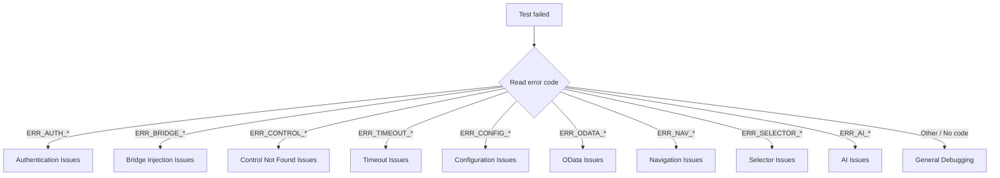

# Troubleshooting

Step-by-step diagnostic guide for common Praman issues. For the full error code
catalog, see [Error Reference](docs/docs/guides/errors.md).

## Quick Diagnostic Flowchart



## Authentication Issues

Errors: `ERR_AUTH_FAILED`, `ERR_AUTH_TIMEOUT`, `ERR_AUTH_SESSION_EXPIRED`, `ERR_AUTH_STRATEGY_INVALID`

### Wrong credentials

**Symptom**: `ERR_AUTH_FAILED` — login page rejects username or password.

**Fixes**:

1. Verify the user is not locked in SAP (check transaction SU01 or BTP user management).
2. Confirm `.env` variables match the target system:

   ```bash
   SAP_CLOUD_BASE_URL=https://your-system.launchpad.cfapps.eu10.hana.ondemand.com
   SAP_CLOUD_USERNAME=your-user@company.com
   SAP_CLOUD_PASSWORD=your-password
   ```

3. If using BTP SAML, ensure the IDP trust configuration is active.

### SSO timeout

**Symptom**: `ERR_AUTH_TIMEOUT` — the login page loads but the SSO redirect never completes.

**Fixes**:

1. Increase the auth timeout in your Praman config:

   ```typescript
   auth: { strategy: 'btp-saml', timeout: 60_000 }
   ```

2. Check whether an MFA prompt is blocking the redirect (agents cannot handle MFA interactively).
3. Run in headed mode (`--headed`) to visually confirm where the flow stalls.

### Missing .env variables

**Symptom**: `ERR_AUTH_STRATEGY_INVALID` or empty credentials at runtime.

**Fixes**:

1. Ensure `.env` is in the project root and contains all required variables.
2. Verify your test runner loads `.env` (Praman reads it automatically via `dotenv`).
3. Never commit `.env` to version control; use `.env.example` as a template.

### Session expired

**Symptom**: `ERR_AUTH_SESSION_EXPIRED` — the test starts but fails mid-run.

**Fixes**:

1. Delete stale session state: `rm -rf .auth/sap-session.json`
2. Re-run the auth seed to generate a fresh session.
3. For long test suites, consider re-authenticating between test groups.

## Bridge Injection Issues

Errors: `ERR_BRIDGE_INJECTION`, `ERR_BRIDGE_TIMEOUT`, `ERR_BRIDGE_NOT_READY`,
`ERR_BRIDGE_VERSION`, `ERR_BRIDGE_EXECUTION`

### CSP blocking injection

**Symptom**: `ERR_BRIDGE_INJECTION` — the bridge script is rejected by Content Security Policy.

**Fixes**:

1. If you control the SAP server, add Praman's domain to the CSP `script-src` directive.
2. For development, launch the browser with CSP disabled:

   ```typescript
   // playwright.config.ts
   use: {
     launchOptions: {
       args: ['--disable-web-security'],
     },
   }
   ```

3. Contact your SAP Basis team if CSP changes require a transport.

### Iframe-based apps (Work Zone)

**Symptom**: `ERR_BRIDGE_INJECTION` or `ERR_BRIDGE_NOT_READY` in SAP Work Zone or multi-frame setups.

**Fixes**:

1. Bridge injection must target each frame separately. Use the `btpWorkZone` fixture for dual-frame management.
2. Check that the correct frame is targeted before interacting with controls.

### UI5 not loaded

**Symptom**: `ERR_BRIDGE_NOT_READY` — the page is loaded but UI5 framework is not initialized.

**Fixes**:

1. Add `await ui5.waitForUI5()` before any control interaction.
2. Verify the page URL actually loads a UI5 application (check for `sap-ui-core.js` in network requests).
3. Increase `ui5WaitTimeout` if the system is slow:

   ```typescript
   ui5WaitTimeout: 60_000;
   ```

## Control Not Found Issues

Errors: `ERR_CONTROL_NOT_FOUND`, `ERR_CONTROL_NOT_VISIBLE`, `ERR_CONTROL_NOT_ENABLED`,
`ERR_CONTROL_NOT_INTERACTABLE`, `ERR_CONTROL_NOT_UI5`

### Typo in control ID

**Symptom**: `ERR_CONTROL_NOT_FOUND` — the selector does not match any control.

**Fixes**:

1. Open UI5 Diagnostics in the browser: press `Ctrl+Shift+Alt+S` to inspect the control tree.
2. Use `npx playwright-praman inspect` to discover controls on the current page.
3. Verify the control ID matches exactly (IDs are case-sensitive).

### Control inside a dialog

**Symptom**: `ERR_CONTROL_NOT_FOUND` for a control that visually appears in a dialog or popover.

**Fixes**:

1. Add `searchOpenDialogs: true` to your selector:

   ```typescript
   await ui5.control({
     controlType: 'sap.m.Button',
     properties: { text: 'OK' },
     searchOpenDialogs: true,
   });
   ```

2. Ensure the dialog is open before searching: `await ui5.dialog.waitFor()`.

### Page not fully loaded

**Symptom**: `ERR_CONTROL_NOT_FOUND` intermittently — works sometimes, fails other times.

**Fixes**:

1. Always call `await ui5.waitForUI5()` after navigation and before control lookup.
2. Increase `controlDiscoveryTimeout` for slow-rendering pages:

   ```typescript
   controlDiscoveryTimeout: 15_000;
   ```

3. Use `ui5.waitFor(selector)` to explicitly wait for a specific control.

## Timeout Issues

Errors: `ERR_TIMEOUT_UI5_STABLE`, `ERR_TIMEOUT_CONTROL_DISCOVERY`, `ERR_TIMEOUT_OPERATION`

### Slow SAP system

**Symptom**: `ERR_TIMEOUT_UI5_STABLE` — UI5 never reaches a stable state.

**Fixes**:

1. Increase `ui5WaitTimeout` in your config (default is 30 seconds):

   ```typescript
   ui5WaitTimeout: 60_000;
   ```

2. Check the SAP system workload. Long-running OData requests or background jobs can delay stability.
3. If the system is consistently slow, consider running tests against a dedicated test system.

### Slow SSO redirect

**Symptom**: `ERR_AUTH_TIMEOUT` combined with `ERR_TIMEOUT_OPERATION`.

**Fixes**:

1. Increase both auth timeout and the global operation timeout.
2. Run in headed mode to identify which redirect step is slow.
3. Check the IDP (e.g., Azure AD) for latency issues.

### Network latency

**Symptom**: Sporadic `ERR_TIMEOUT_OPERATION` failures across different operations.

**Fixes**:

1. Run tests closer to the SAP system (same region, same network).
2. Enable Playwright's built-in retry: `retries: 2` in `playwright.config.ts`.
3. For CI/CD, prefer SAP-hosted runners or cloud agents in the same data center.

## Configuration Issues

Errors: `ERR_CONFIG_INVALID`, `ERR_CONFIG_NOT_FOUND`, `ERR_CONFIG_PARSE`

### Unknown config key

**Symptom**: `ERR_CONFIG_INVALID` — Zod strict-mode schema validation rejects an unknown key.

**Fixes**:

1. Check your config for typos. Common mistakes:
   - `ui5Timeout` instead of `ui5WaitTimeout`
   - `logLevel: 'verbose'` instead of `logLevel: 'debug'`
2. Refer to the [Configuration guide](docs/docs/guides/configuration.md) for all valid options.

### Config file not found

**Symptom**: `ERR_CONFIG_NOT_FOUND` — Praman cannot locate the config file.

**Fixes**:

1. Ensure `praman.config.ts` (or `.js`) exists in the project root.
2. If using a custom path, pass it explicitly: `defineConfig({ configFile: './custom.config.ts' })`.

### Parse error

**Symptom**: `ERR_CONFIG_PARSE` — the config file has a syntax error.

**Fixes**:

1. Run `npx tsc --noEmit` to check for TypeScript errors in your config.
2. Verify the file exports a valid config object (not a function, unless using `defineConfig`).

## OData Issues

Errors: `ERR_ODATA_REQUEST_FAILED`, `ERR_ODATA_PARSE`, `ERR_ODATA_CSRF`

### 403 Forbidden

**Symptom**: `ERR_ODATA_REQUEST_FAILED` with HTTP 403.

**Fixes**:

1. Check PFCG roles for the test user in SAP — the user may lack authorization for the OData service.
2. Verify the OData service is activated in transaction IWFND/MAINT_SERVICE (on-premise) or the BTP service binding.
3. Check if a CSRF token is required and not being sent.

### 404 Not Found

**Symptom**: `ERR_ODATA_REQUEST_FAILED` with HTTP 404.

**Fixes**:

1. Verify the entity set name matches exactly (case-sensitive).
2. Check the OData service URL — ensure the service path and version are correct.
3. Use browser DevTools Network tab to inspect the actual OData request URL.

### CSRF token expired

**Symptom**: `ERR_ODATA_CSRF` — CSRF token validation failed.

**Fixes**:

1. Call `ui5.odata.fetchCSRFToken(serviceUrl)` before write operations.
2. If using batch requests, ensure the token is refreshed before each batch.
3. For long-running tests, tokens may expire — re-fetch before critical write operations.

## Agent-Generated Test Failures

When a test generated by `praman-sap-generate` or `praman-sap-heal` fails, follow these steps.

For a comprehensive guide, see [Debugging Agent Failures](docs/docs/guides/debugging-agent-failures.md).

### Stale selectors

**Symptom**: `ERR_CONTROL_NOT_FOUND` — the generated selector no longer matches.

**Fixes**:

1. Run `npx playwright-praman snapshot` to capture the current page state.
2. Compare the generated selector against live controls.
3. Re-run `praman-sap-heal` to auto-fix stale selectors.

### Missing auth in seed

**Symptom**: `ERR_AUTH_FAILED` — the generated test assumes authentication is already done.

**Fixes**:

1. Verify the auth seed ran successfully and `.auth/sap-session.json` exists.
2. Check that `playwright.config.ts` has the correct `storageState` path.
3. Re-run the seed: `npx playwright test --project=agent-seed-test`.

### Wrong app navigation

**Symptom**: `ERR_NAV_TILE_NOT_FOUND` — the tile name in the generated test does not match the FLP.

**Fixes**:

1. Run in headed mode (`--headed`) to see the actual FLP tile names.
2. Update the tile name in the generated test or re-run the planner with the correct app name.

### Control type mismatch

**Symptom**: `ERR_CONTROL_NOT_FOUND` — the generated test uses the wrong SAP control type.

**Fixes**:

1. Use UI5 Diagnostics (`Ctrl+Shift+Alt+S`) to verify the actual control type.
2. Check if the app uses V2 (SmartField) or V4 (MDC) controls — they have different type names.
3. Re-run `praman-sap-heal` which auto-detects the correct control types.

## TypeScript Issues

### `error TS2694: Namespace '"worker_threads"' has no exported member 'TransferListItem'`

You will only see this if **both** are true:

- your `tsconfig.json` sets `"skipLibCheck": false`, and
- you have `@types/node` v26 or newer installed.

The error points at `node_modules/thread-stream/index.d.ts`, not at Praman. It
comes from `thread-stream`, a transitive dependency of `pino` (Praman's logger).
`@types/node` v26 removed `TransferListItem` from the `worker_threads` module
declaration, and `thread-stream` has not yet been updated. There is no released
fix upstream, and it cannot be corrected from inside Praman.

Praman's own shipped type declarations are unaffected — they compile cleanly on
TypeScript 5.9 through 7.0 under `node16`, `nodenext`, and `bundler` resolution,
which CI verifies on every commit.

Pick whichever workaround suits your project:

```jsonc
// tsconfig.json — recommended, and the default in most TS setups
{
  "compilerOptions": {
    "skipLibCheck": true,
  },
}
```

```jsonc
// package.json — if you must keep skipLibCheck: false, pin @types/node below v26
{
  "overrides": {
    "@types/node": "^24",
  },
}
```

### Which TypeScript versions are supported?

Praman's published types are tested against **5.9.3, 6.0.2, 6.0.3, and 7.0.2**,
each under `node16`, `nodenext`, and `bundler` module resolution.

TypeScript 7.0 is supported for _consuming_ Praman. Note that TS 7.0 does not
yet ship the classic compiler API (`import ts from 'typescript'` returns only a
version stub; the programmatic API returns in 7.1), so tools such as
typescript-eslint, typedoc, and declaration bundlers still require a TypeScript
6.0 install. That affects your own toolchain, not your ability to use Praman.

## General Debugging

When no specific error code is available, use these general debugging techniques.

### Enable debug logging

Set the `PRAMAN_DEBUG` environment variable:

```bash
PRAMAN_DEBUG=true npx playwright test
```

Or set `logLevel: 'debug'` in your Praman config for verbose output.

### Run the doctor command

Praman includes a built-in diagnostics command:

```bash
npx playwright-praman doctor
```

This checks your environment, config, and dependencies for common issues.

### Use headed mode

Run tests with the browser visible to see what is happening:

```bash
npx playwright test --headed
```

This is especially useful for diagnosing navigation and auth issues.

### Use Playwright trace viewer

Enable tracing to capture a detailed timeline of every action:

```typescript
// playwright.config.ts
use: {
  trace: 'on-first-retry',
}
```

Then view the trace:

```bash
npx playwright show-trace trace.zip
```

### Check UI5 version compatibility

Praman supports UI5 1.71 and above. Run:

```bash
npx playwright-praman inspect --version
```

If the target system runs an unsupported UI5 version, you may see `ERR_BRIDGE_VERSION`.
