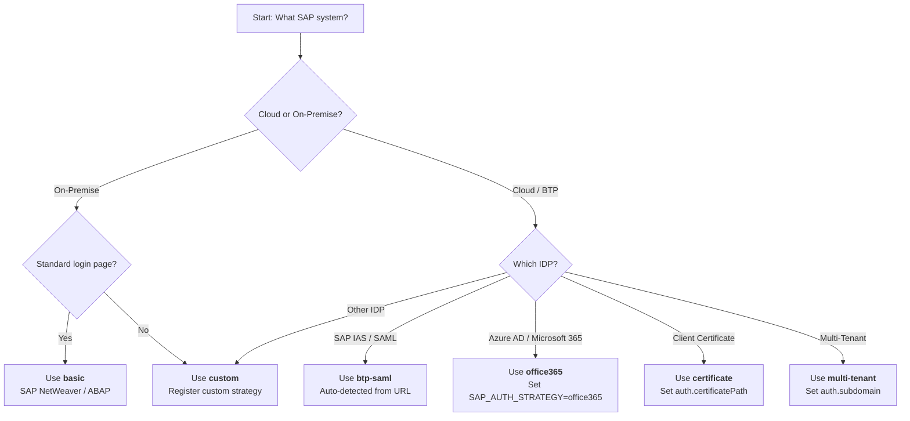

:::info[In this guide]

- Choose the right authentication strategy for your SAP system (on-premise, BTP, Office 365)
- Configure the setup project pattern for authenticate-once, reuse-everywhere
- Set up environment variables for each auth strategy
- Use the `sapAuth` fixture for explicit auth control in tests
- Handle session expiry and BTP WorkZone frame contexts

:::

Praman supports 6 pluggable authentication strategies for SAP systems.

## Auth Strategy Decision Flowchart



## Auth Strategy Mapping

The `auth.strategy` config field accepts 4 values. Each maps to an internal
strategy implementation:

| Config Value | Strategy File          | Use Case                         |
| ------------ | ---------------------- | -------------------------------- |
| `basic`      | onprem-strategy.ts     | SAP NetWeaver / ABAP on-premise  |
| `btp-saml`   | cloud-saml-strategy.ts | SAP BTP Cloud via IAS / SAML     |
| `office365`  | office365-strategy.ts  | Azure AD / Microsoft 365 SSO     |
| `custom`     | (user-provided)        | Custom IDP or non-standard login |

### Specialized Strategies (Not Config-Selectable)

These strategies are used programmatically, not via the `auth.strategy` config:

- **api-strategy.ts** — Headless API-based auth (for CI/CD token-based auth).
  Use via `sapAuth.loginWithApi()`.
- **certificate-strategy.ts** — Client certificate auth (configured at
  browser context level in `playwright.config.ts`, not via Praman config).
- **multi-tenant-strategy.ts** — BTP multi-tenant routing (delegates to
  cloud-saml or onprem internally, selected by `SAP_ACTIVE_SYSTEM` env var).

## Which Strategy Do I Need?

If you don't set `auth.strategy` explicitly, Praman auto-detects based on your config
fields and URL pattern. The priority chain is:

| Priority | Condition                         | Strategy Selected                                         | Example                                                    |
| -------- | --------------------------------- | --------------------------------------------------------- | ---------------------------------------------------------- |
| 1        | `auth.strategy` is set explicitly | The named strategy (custom registry first, then built-in) | `strategy: 'office365'`                                    |
| 2        | `auth.certificatePath` is set     | Client Certificate                                        | `certificatePath: '/certs/client.p12'`                     |
| 3        | `auth.subdomain` is set           | Multi-Tenant (delegates to cloud-saml or onprem)          | `subdomain: 'customer-a'`                                  |
| 4        | URL matches a cloud pattern       | Cloud SAML (IAS)                                          | `*.cloud.sap`, `*.s4hana.cloud.sap`, `*.hana.ondemand.com` |
| 5        | None of the above                 | On-Premise (Basic Auth)                                   | Any other URL                                              |

### Decision by SAP System Type

| Your SAP System             | Set These Env Vars                                                          | Strategy Used                   |
| --------------------------- | --------------------------------------------------------------------------- | ------------------------------- |
| S/4HANA Cloud               | `SAP_CLOUD_BASE_URL=https://tenant.s4hana.cloud.sap`                        | Auto-detected: **Cloud SAML**   |
| BTP Launchpad               | `SAP_CLOUD_BASE_URL=https://tenant.launchpad.cfapps.eu10.hana.ondemand.com` | Auto-detected: **Cloud SAML**   |
| BTP + Azure AD SSO          | Same as above + `SAP_AUTH_STRATEGY=office365`                               | Explicit: **Office 365**        |
| SAP ECC / NetWeaver on-prem | `SAP_ONPREM_BASE_URL=https://sap.corp:8443/...`                             | Auto-detected: **On-Premise**   |
| BTP Multi-Tenant            | `SAP_CLOUD_BASE_URL` + `SAP_SUBDOMAIN=customer-a`                           | Auto-detected: **Multi-Tenant** |
| Client Certificate (PKI)    | `SAP_CERTIFICATE_PATH=/certs/client.p12`                                    | Auto-detected: **Certificate**  |
| Non-standard IDP            | `SAP_AUTH_STRATEGY=custom` + custom strategy registration                   | Explicit: **Custom**            |

### Cloud URL Patterns (Auto-Detection)

These URL patterns trigger Cloud SAML auto-detection:

- `*.cloud.sap`
- `*.s4hana.cloud.sap`
- `*.hana.ondemand.com`
- `*.cfapps.*.hana.ondemand.com`

If your Cloud URL doesn't match these patterns, set `auth.strategy: 'btp-saml'` explicitly.

## Setup Project Pattern

The recommended pattern uses Playwright's **setup projects** to authenticate once and share the session across all tests.

### 1. Auth Setup File

Create `tests/auth-setup.ts` using the `sapAuth` fixture (provided by `playwright-praman`):

```typescript
// tests/auth-setup.ts
import { join } from 'node:path';
import { test as setup } from 'playwright-praman';

const authFile = join(process.cwd(), '.auth', 'sap-session.json');

setup('SAP authentication', async ({ sapAuth, page, context }) => {
  // sapAuth is auto-configured from praman config and environment variables.
  // The fixture resolves the correct strategy based on SAP_ACTIVE_SYSTEM
  // and SAP_AUTH_STRATEGY env vars.
  await sapAuth.login(page);

  await context.storageState({ path: authFile });
});
```

:::info[No direct auth imports]
`SAPAuthHandler` and `createAuthStrategy` are **not** public exports.
The `playwright-praman/auth` sub-path does **not** exist.
All authentication is done through the `sapAuth` fixture, which reads
credentials and strategy from the Praman config / environment variables.
:::

### 2. Playwright Config

```typescript
// playwright.config.ts
import { defineConfig, devices } from '@playwright/test';

export default defineConfig({
  projects: [
    {
      name: 'setup',
      testMatch: /auth-setup\.ts/,
      teardown: 'teardown',
    },
    {
      name: 'teardown',
      testMatch: /auth-teardown\.ts/,
    },
    {
      name: 'chromium',
      dependencies: ['setup'],
      use: {
        ...devices['Desktop Chrome'],
        storageState: '.auth/sap-session.json',
      },
    },
  ],
});
```

### 3. Tests Use Saved Session

```typescript
// tests/purchase-order.spec.ts
import { test, expect } from 'playwright-praman';

// No login code needed — storageState handles it
test('navigate after auth', async ({ ui5Navigation }) => {
  await ui5Navigation.navigateToApp('PurchaseOrder-manage');
});
```

## Strategy Examples

### On-Premise (`onprem`)

```bash
# .env
SAP_ACTIVE_SYSTEM=onprem
SAP_ONPREM_BASE_URL=https://sapserver.example.com:8443/sap/bc/ui5_ui5/
SAP_ONPREM_USERNAME=TESTUSER
SAP_ONPREM_PASSWORD=secret
SAP_CLIENT=100
SAP_LANGUAGE=EN
```

### Cloud SAML (`cloud-saml`)

```bash
# .env
SAP_ACTIVE_SYSTEM=cloud
SAP_CLOUD_BASE_URL=https://tenant.launchpad.cfapps.eu10.hana.ondemand.com
SAP_CLOUD_USERNAME=user@company.com
SAP_CLOUD_PASSWORD=secret
```

### Office 365 SSO

```bash
# .env
SAP_ACTIVE_SYSTEM=cloud
SAP_AUTH_STRATEGY=office365
SAP_CLOUD_BASE_URL=https://tenant.launchpad.cfapps.eu10.hana.ondemand.com
SAP_CLOUD_USERNAME=user@company.onmicrosoft.com
SAP_CLOUD_PASSWORD=secret
```

## Using the `sapAuth` Fixture

For tests that need explicit auth control:

```typescript
// tests/explicit-auth.spec.ts
import { test, expect } from 'playwright-praman';

test('explicit auth', async ({ sapAuth, page }) => {
  // sapAuth.login() uses credentials from praman config / env vars.
  // Pass overrides only when needed:
  await sapAuth.login(page, {
    url: 'https://sapserver.example.com',
    username: 'TESTUSER',
    password: 'secret',
    strategy: 'onprem',
  });

  // isAuthenticated() requires the page parameter
  expect(await sapAuth.isAuthenticated(page)).toBe(true);

  const session = sapAuth.getSessionInfo();
  // SessionInfo has: authenticatedAt, strategyName, isValid
  expect(session.isValid).toBe(true);
  expect(session.strategyName).toBe('onprem');

  // Auto-logout on fixture teardown
});
```

:::tip[Strategy name mapping]
The config schema names map to runtime strategy names as follows:

| Config Value  | Runtime `strategyName` |
| ------------- | ---------------------- |
| `'basic'`     | `'onprem'`             |
| `'btp-saml'`  | `'cloud-saml'`         |
| `'office365'` | `'office365'`          |
| `'custom'`    | User-provided name     |

When checking `session.strategyName`, use the **runtime** name (right column).
:::

## Session Expiry

The default session timeout is 1800 seconds (30 minutes), matching SAP ICM defaults.
The 30-minute default matches SAP ICM session timeout defaults.

## BTP WorkZone Authentication

BTP WorkZone renders apps inside nested iframes. The `btpWorkZone` fixture handles frame context automatically:

```typescript
// tests/workzone.spec.ts
test('WorkZone app', async ({ btpWorkZone, ui5 }) => {
  const appFrame = btpWorkZone.getAppFrameForEval();
  // All operations route through the correct frame
});
```

:::warning[Common mistake]
Do not import `SAPAuthHandler` or `createAuthStrategy` directly. These are internal APIs.
All authentication must go through the `sapAuth` fixture, which reads credentials and strategy
from the Praman config and environment variables automatically.
:::

## FAQ

<details>
<summary>Which authentication strategy should I use for my SAP system?</summary>

Use the decision flowchart at the top of this page. In short:

- **SAP BTP / S/4HANA Cloud** with SAP IAS: Use `btp-saml` (auto-detected from URL)
- **SAP BTP with Azure AD / Microsoft SSO**: Set `SAP_AUTH_STRATEGY=office365`
- **SAP NetWeaver / ECC on-premise**: Use `basic` (auto-detected for non-cloud URLs)
- **Client certificate (PKI)**: Set `auth.certificatePath` in config
- **Multi-tenant BTP**: Set `auth.subdomain` in config
- **Non-standard IDP**: Use `custom` with a registered strategy

If unsure, let Praman auto-detect — it uses URL patterns to choose the right strategy.

</details>

<details>
<summary>How do I debug authentication failures?</summary>

Run the auth setup in headed mode to see what happens in the browser:

```bash
npx playwright test tests/auth-setup.ts --headed --debug
```

Common causes:

- **Wrong URL**: `SAP_CLOUD_BASE_URL` must be the Fiori Launchpad URL, not an API endpoint
- **Wrong strategy**: A cloud URL with `SAP_AUTH_STRATEGY=basic` will fail — use `btp-saml`
- **MFA / TOTP**: Praman does not handle multi-factor auth automatically. Use `custom` strategy with manual MFA handling, or use API tokens
- **Session expired**: The default session timeout is 30 minutes. Increase `auth.sessionTimeout` for long-running test suites

</details>

<details>
<summary>Can I use saved cookies or tokens instead of username/password?</summary>

Yes. The setup project pattern saves the browser session to `.auth/sap-session.json` after
the first login. All subsequent tests reuse this session without re-authenticating. This is the
recommended approach — it runs login once and shares the session across all test files.

For headless CI/CD environments, you can also use `sapAuth.loginWithApi()` via the
`api-strategy.ts` for token-based authentication without a browser login flow.

</details>

<details>
<summary>Why does auth work locally but fail in CI?</summary>

Check these common CI issues:

- Environment variables (`SAP_CLOUD_BASE_URL`, `SAP_CLOUD_USERNAME`, `SAP_CLOUD_PASSWORD`) must be set as CI secrets
- The CI runner must have network access to the SAP system (VPN, allowlisted IPs)
- Use `storageState` in `playwright.config.ts` to reuse auth sessions across tests
- Increase timeouts for slow CI networks: set `auth.loginTimeout` to `60000` or higher

</details>

:::tip[Next steps]

- **[Getting Started →](./getting-started)** — Install Praman and run your first test
- **[Agent & IDE Setup →](./agent-setup)** — Configure AI agents that handle auth automatically
- **[Selectors Guide →](./selectors)** — Learn how to find UI5 controls after authentication

:::
