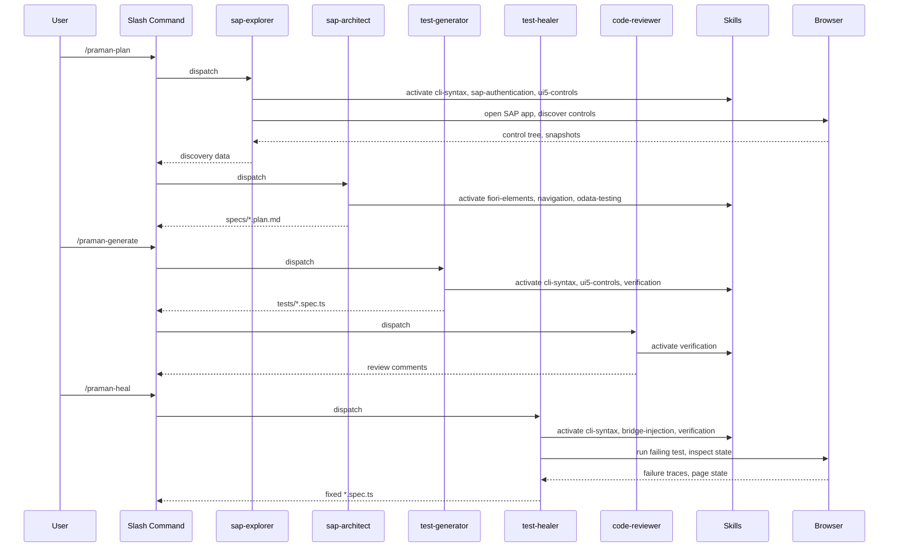

# Agents and Skills

:::info[In this guide]

- Understand the 5 AI agents and when each is dispatched by plugin commands
- Learn how 8 auto-activating skills provide domain knowledge to agents
- See the sequence from command invocation through agents, skills, and browser interaction
- Know the boundary between agent context (discovery with raw APIs) and test context (Praman fixtures)
- Route custom prompts to the correct agent or skill

:::

The Praman Claude Code plugin dispatches specialized AI agents to perform SAP test automation
tasks. Each agent automatically activates relevant skills -- curated domain knowledge modules
that provide SAP UI5 patterns, Praman API references, and compliance rules.

## Agent Overview

| Agent            | Model  | Color  | Role                                         |
| ---------------- | ------ | ------ | -------------------------------------------- |
| `sap-explorer`   | Sonnet | Blue   | Discover UI5 controls in a live SAP app      |
| `sap-architect`  | Sonnet | Green  | Design test scenarios from discovery data    |
| `test-generator` | Sonnet | Yellow | Generate compliant `.spec.ts` files          |
| `test-healer`    | Opus   | Red    | Diagnose and fix failing tests               |
| `code-reviewer`  | Sonnet | Purple | Validate generated code against quality gate |

## Command-to-Agent Dispatch



## Agents

### sap-explorer

**Role:** Opens a live SAP system in a browser session, authenticates, navigates the Fiori
Launchpad, and discovers all UI5 controls on each page.

**When it triggers:** Dispatched by `/praman-plan` and `/praman-coverage`.

**Preflight skills:** `cli-syntax`, `sap-authentication`, `ui5-controls`

**What it produces:**

- Page snapshots (`.yml` files) at each navigation point
- Control inventory with IDs, types, binding paths, and aggregation info
- FLP navigation pattern detection (GenericTile, Space Tab, Section Link)

**Manual invocation:**

```text
"Explore the Manage Sales Orders app and capture all UI5 controls
on the list report and object page"
```

**Key fact:** `sap-explorer` uses `run-code` with raw `sap.ui.core.Element.registry.all()`
calls during discovery. This is agent context -- it does not use Praman fixtures.

---

### sap-architect

**Role:** Takes the raw discovery data from `sap-explorer` and designs structured test
scenarios with steps, selectors, and expected outcomes.

**When it triggers:** Dispatched by `/praman-plan` and `/praman-coverage`, after
`sap-explorer` completes.

**Preflight skills:** `fiori-elements`, `navigation`, `odata-testing`

**What it produces:**

- Structured test plan (`specs/<app>.plan.md`)
- Scenario definitions with step-by-step actions
- Recommended selector strategy per control (binding path > properties > ID)

**Manual invocation:**

```text
"Design test scenarios for the purchase order app based on the
discovery data in specs/snapshots/"
```

**Key fact:** `sap-architect` never opens a browser. It works entirely from the discovery
artifacts produced by `sap-explorer`.

---

### test-generator

**Role:** Reads a test plan and generates compliant `.spec.ts` files using Praman fixtures
exclusively.

**When it triggers:** Dispatched by `/praman-generate` and `/praman-coverage`.

**Preflight skills:** `cli-syntax`, `ui5-controls`, `verification`

**What it produces:**

- Test files (`tests/e2e/<app>.spec.ts`) with `test.step()` structure
- TSDoc compliance headers
- Quality gate report listing any violations found and auto-fixed

**Manual invocation:**

```text
"Generate Praman tests from the plan at specs/manage-purchase-orders.plan.md"
```

**Key fact:** `test-generator` runs the quality gate (19 forbidden patterns + 7 mandatory
rules) after writing each file. It auto-fixes up to 3 iterations before surfacing remaining
issues.

---

### test-healer

**Role:** Runs failing tests, classifies each failure, proposes fixes with confidence
scores, and applies high-confidence fixes automatically.

**When it triggers:** Dispatched by `/praman-heal` and `/praman-coverage`.

**Preflight skills:** `cli-syntax`, `bridge-injection`, `verification`

**What it produces:**

- Fixed test files with updated selectors, timing, or logic
- Healing report with failure classification and confidence scores
- Playwright traces from diagnostic test runs

**Manual invocation:**

```text
"Fix the failing test in tests/e2e/create-purchase-order.spec.ts"
```

**Key fact:** `test-healer` uses **Opus** for complex failure diagnosis, unlike the other
agents which use Sonnet. This allows deeper reasoning about multi-step failures, race
conditions, and app behavior changes.

---

### code-reviewer

**Role:** Validates generated or healed test files against the full Praman quality gate
and compliance rules.

**When it triggers:** Dispatched by `/praman-generate` after test files are written.

**Preflight skills:** `verification`

**What it produces:**

- Inline review comments in the conversation
- Pass/fail verdict for each file
- Specific suggestions for remaining violations

**Manual invocation:**

```text
"Review tests/e2e/manage-purchase-orders.spec.ts for Praman compliance"
```

**Key fact:** `code-reviewer` checks the same 19 forbidden patterns and 7 mandatory rules
as the generator quality gate, but acts as an independent second pass. It catches issues
that auto-fix may have introduced.

---

## Skills

Skills are domain knowledge modules that activate automatically based on the task context.
Agents do not choose skills explicitly -- the routing system matches user intent to the
relevant skill.

### Skill Routing Table

| User Intent                                   | Skill Activated      |
| --------------------------------------------- | -------------------- |
| Any browser command or CLI interaction        | `cli-syntax`         |
| Login, SSO, certificate auth, state save/load | `sap-authentication` |
| Control discovery, interaction, properties    | `ui5-controls`       |
| List Report, Object Page, FE patterns         | `fiori-elements`     |
| OData read, create, mock, batch               | `odata-testing`      |
| FLP navigation, intent, hash, tile            | `navigation`         |
| Bridge init, injection, readiness check       | `bridge-injection`   |
| Claiming task complete, final check           | `verification`       |

### Skill Details

#### cli-syntax (mandatory for all browser agents)

**Trigger:** Any agent that interacts with the browser or writes CLI commands.

**Key capabilities:**

- Correct `playwright-cli` and `run-code` command syntax
- Session management (`-s=<name>`, `state-save`, `state-load`)
- **Rule 0:** `return` values from `run-code` (never `console.log()`)

This skill is mandatory for `sap-explorer`, `test-generator`, and `test-healer`. Without
it, agents produce invalid CLI commands that fail silently.

---

#### sap-authentication

**Trigger:** Login flows, SSO handling, auth state persistence.

**Key capabilities:**

- SAP IDP redirect detection and wait patterns
- `state-save` / `state-load` for session reuse across commands
- Certificate-based and basic auth patterns

---

#### ui5-controls

**Trigger:** Control discovery, property reading, interaction patterns.

**Key capabilities:**

- `Element.registry.all()` discovery pattern (not `ElementRegistry.all()`)
- Control type hierarchy and metadata reading
- `setValue()` + `fireChange()` + `waitForUI5()` input sequence

---

#### fiori-elements

**Trigger:** Fiori Elements apps (List Report, Object Page, Analytical List Page).

**Key capabilities:**

- FE-generated control ID patterns (`fe::`, `sap.fe.`)
- V4 action parameter dialog handling (`fe::APD_::`)
- Standard FE button actions (Create, Save, Delete, Edit)

---

#### odata-testing

**Trigger:** OData service calls, mock data, batch operations.

**Key capabilities:**

- V2 and V4 request interception patterns
- Mock server setup for offline testing
- Batch request grouping verification

---

#### navigation

**Trigger:** FLP navigation, semantic object routing, hash-based navigation.

**Key capabilities:**

- GenericTile, Space Tab, Section Link pattern detection
- `navigateToIntent()` with semantic object and action
- Cross-app navigation and parameter passing

---

#### bridge-injection

**Trigger:** Praman bridge initialization, readiness checks, injection failures.

**Key capabilities:**

- `initScript` configuration for `praman-cli.config.json`
- Bridge readiness detection (`window.__praman__` availability)
- Troubleshooting injection failures in different browser contexts

---

#### verification (gatekeeper)

**Trigger:** Any agent claiming task completion, final quality check.

**Key capabilities:**

- 19 forbidden pattern scan (e.g., `page.waitForTimeout`, raw `page.click`)
- 7 mandatory rule enforcement (imports, `test.step`, input sequence, TSDoc)
- Auto-fix suggestion generation with before/after code diffs

This skill acts as the gatekeeper. It activates whenever an agent claims completion, ensuring
no non-compliant code is presented to the user as finished work.

---

## Agent-Fixture Boundary

Understanding the boundary between agent context and test context is critical for working
with the Praman plugin.

| Context           | Used By                       | API Style                           | Purpose          |
| ----------------- | ----------------------------- | ----------------------------------- | ---------------- |
| Agent (discovery) | `sap-explorer`, `test-healer` | `run-code` with raw SAP APIs        | Explore live app |
| Test (fixtures)   | Generated `.spec.ts` files    | `ui5.press()`, `ui5.fill()`, `fe.*` | Automated tests  |

During **agent context** (discovery phase), agents use `run-code` with raw JavaScript to
call `sap.ui.core.Element.registry.all()`, read control metadata, and inspect page state.
This is necessary because the agent needs unrestricted access to the UI5 runtime.

During **test context** (generated test files), all interactions must use Praman fixtures
(`ui5.press()`, `ui5.fill()`, `fe.objectPage.clickSave()`). Raw page interactions are
forbidden in generated tests.

```typescript
// AGENT CONTEXT: sap-explorer uses run-code for discovery
// This is correct for agents — raw SAP API access
await page.evaluate(() => {
  const registry = sap.ui.core.Element.registry.all();
  return Object.keys(registry).map((id) => ({
    id,
    type: registry[id].getMetadata().getName(),
  }));
});
```

```typescript
// TEST CONTEXT: generated .spec.ts uses Praman fixtures
// This is correct for tests — fixture-based interaction
import { test, expect } from 'playwright-praman';

test('create purchase order', async ({ ui5, fe }) => {
  await test.step('fill supplier', async () => {
    await ui5.fill({ id: /Supplier/ }, '100001');
  });
  await test.step('save', async () => {
    await fe.objectPage.clickSave();
  });
});
```

:::warning[Common mistake]

**Confusing agent context with test context.** When writing prompts for `sap-explorer`,
you can reference raw SAP APIs like `Element.registry.all()` and `getMetadata()`. But
when reviewing generated test files, every interaction must use Praman fixtures. If you
see `page.evaluate()` or `page.click('#__control0')` in a `.spec.ts` file, it is a
compliance violation that the `verification` skill should catch.

:::

:::warning[Common mistake]

**Trying to use `ui5.press()` in agent CLI commands.** Praman fixtures like `ui5.press()`,
`ui5.fill()`, and `fe.objectPage.clickSave()` are only available inside Playwright test
files that import from `playwright-praman`. They do not exist in the `run-code` execution
context. During agent exploration, use `playwright-cli click <ref>` or `run-code` with
raw DOM/UI5 APIs instead.

:::

## FAQ

<details>
<summary>Can I add custom agents to the Praman plugin?</summary>

Yes. Create a new `.md` file in `.claude/agents/` following the existing agent frontmatter
format. Define the agent's `model`, `description`, `when-to-use`, and `instructions`
sections. Your custom agent can reference existing skills by including their names in the
instructions. However, custom agents will not be dispatched automatically by the four slash
commands -- you invoke them manually by name or prompt.

</details>

<details>
<summary>Which agent uses Opus and which uses Sonnet?</summary>

Only `test-healer` uses Opus. All other agents (`sap-explorer`, `sap-architect`,
`test-generator`, `code-reviewer`) use Sonnet. The healer needs Opus for complex
multi-step failure diagnosis where deeper reasoning significantly improves fix accuracy.
Sonnet is sufficient for discovery, planning, generation, and review tasks where the
patterns are more structured.

</details>

<details>
<summary>How does skill routing work?</summary>

Skills activate automatically based on the task context, not by explicit agent selection.
When an agent begins a task, the routing system matches the task intent (e.g., "discover
controls", "fix failing test", "validate compliance") to the relevant skills. Multiple
skills can activate simultaneously -- for example, `test-healer` typically activates
`cli-syntax`, `bridge-injection`, and `verification` together. You do not need to
manually specify which skills to use.

</details>

<details>
<summary>What is Rule 0 in the cli-syntax skill?</summary>

Rule 0 states that inside `run-code`, only `return` produces output visible to the agent.
Using `console.log()` sends output to the browser console where the agent cannot read it.
This is the most common cause of "empty response" issues during discovery. Always write
`return` in `run-code` callbacks:

```javascript
// Correct
playwright-cli run-code "async page => { return await page.title(); }"

// Wrong — agent sees nothing
playwright-cli run-code "async page => { console.log(await page.title()); }"
```

</details>

:::tip[Next steps]

- **[Mandatory Rules -->](./gold-standard-test.md)** -- the 7 rules every generated test must follow
- **[Plugin Commands Reference -->](./claude-code-plugin-commands.md)** -- detailed reference for all 4 slash commands
- **[Forbidden Patterns -->](./playwright-cli-reference.md)** -- the 19 patterns that trigger quality gate failures

:::
