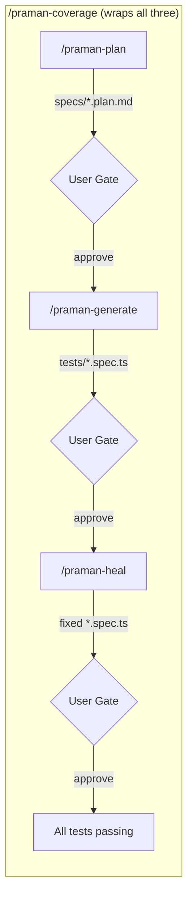

# Plugin Commands Reference

:::info[In this guide]

- Run `/praman-plan` to explore a live SAP app and produce a structured test plan
- Run `/praman-generate` to convert a plan into compliant Praman `.spec.ts` files
- Run `/praman-heal` to automatically diagnose and fix failing tests with confidence scoring
- Run `/praman-coverage` for the full pipeline: plan, generate, and heal with user gates
- Understand the agents dispatched, artifacts produced, and user gates at each phase

:::

The Praman Claude Code plugin provides four slash commands that form a complete SAP test
automation pipeline. Each command dispatches specialized AI agents, produces specific
artifacts, and pauses at user gates for review before proceeding.

## Pipeline Overview



## Command Reference

### `/praman-plan`

**Purpose:** Explore a live SAP Fiori app and produce a structured test plan.

**Argument hint:** A natural-language description of the app and scenarios to cover.

**Example invocation:**

```text
/praman-plan
"Explore the Manage Purchase Orders app and plan tests for creating
a PO with 2 line items, editing quantity, and deleting a line item"
```

**What happens step-by-step:**

1. Dispatches `sap-explorer` agent to open the SAP app in a browser session
2. `sap-explorer` authenticates, navigates FLP, and discovers all UI5 controls
3. Dispatches `sap-architect` agent to design test scenarios from the discovery data
4. `sap-architect` structures scenarios with control IDs, types, and binding paths
5. Writes the test plan to `specs/<app-name>.plan.md`
6. **User gate:** Presents the plan for review before proceeding

**Output artifacts:**

| Artifact                | Location                | Contents                                         |
| ----------------------- | ----------------------- | ------------------------------------------------ |
| Test plan               | `specs/<app>.plan.md`   | Scenarios, steps, control selectors, data values |
| Discovery snapshots     | `specs/snapshots/*.yml` | Page structure at each navigation point          |
| Gold-standard reference | `specs/<app>.gold.md`   | Expected fixture calls for each step             |

---

### `/praman-generate`

**Purpose:** Load an existing plan and generate compliant Praman test files.

**Argument hint:** Path to the plan file, or omit to auto-detect the most recent plan.

**Example invocations:**

```text
/praman-generate specs/manage-purchase-orders.plan.md
```

```text
/praman-generate
```

**What happens step-by-step:**

1. Loads the plan file and parses scenarios
2. Dispatches `test-generator` agent for each scenario in the plan
3. `test-generator` writes `.spec.ts` files using Praman fixtures exclusively
4. Runs the quality gate: 19 forbidden patterns + 7 mandatory rules
5. If violations found, auto-fixes up to 3 iterations
6. Dispatches `code-reviewer` agent for final compliance check
7. **User gate:** Presents generated files for review

**Output artifacts:**

| Artifact        | Location                  | Contents                                 |
| --------------- | ------------------------- | ---------------------------------------- |
| Test files      | `tests/e2e/<app>.spec.ts` | Praman-compliant test code               |
| Quality report  | `specs/<app>.quality.md`  | Rule violations found and auto-fixed     |
| Review comments | Inline in conversation    | `code-reviewer` findings and suggestions |

**Quality gate details:**

The 19 forbidden patterns include `page.click('#__...')`, `page.waitForTimeout()`,
`@playwright/test` imports, and raw DOM selectors. The 7 mandatory rules enforce
`playwright-praman` imports, `test.step()` structure, `setValue()` + `fireChange()` +
`waitForUI5()` sequences, and TSDoc headers. Auto-fix attempts up to 3 iterations
before presenting remaining issues to the user.

---

### `/praman-heal`

**Purpose:** Run failing tests, diagnose failures, and apply fixes automatically.

**Argument hint:** Path to a specific test file, or omit to heal all failing tests.

**Example invocations:**

```text
/praman-heal tests/e2e/manage-purchase-orders.spec.ts
```

```text
/praman-heal
```

**What happens step-by-step:**

1. Runs the test suite and collects failure results
2. Dispatches `test-healer` agent to classify each failure
3. `test-healer` assigns a confidence score (0-100) to each proposed fix
4. Fixes with confidence >= 80 are auto-applied without user confirmation
5. Fixes with confidence < 80 are presented for user review
6. Re-runs tests after applying fixes (max 3 healing iterations)
7. **User gate:** Presents final results and any remaining failures

**Confidence scoring:**

| Score Range | Behavior               | Example                                |
| ----------- | ---------------------- | -------------------------------------- |
| 80-100      | Auto-applied           | Selector ID changed, timeout too short |
| 50-79       | Suggested, user review | Logic change, different control type   |
| 0-49        | Reported only          | App behavior changed, new dialog       |

**Output artifacts:**

| Artifact        | Location                  | Contents                             |
| --------------- | ------------------------- | ------------------------------------ |
| Fixed test file | `tests/e2e/<app>.spec.ts` | Updated test code with fixes applied |
| Healing report  | `specs/<app>.healing.md`  | Failures classified, fixes applied   |
| Trace files     | `test-results/`           | Playwright traces for failed runs    |

---

### `/praman-coverage`

**Purpose:** Run the full pipeline -- plan, generate, and heal -- with user gates between
each phase.

**Argument hint:** A natural-language description of the app and desired test coverage.

**Example invocation:**

```text
/praman-coverage
"Generate complete test coverage for the Create Purchase Order app
including happy path, validation errors, and draft handling"
```

**What happens step-by-step:**

1. Runs `/praman-plan` (dispatches `sap-explorer` + `sap-architect`)
2. **User gate 1:** Review and approve the test plan
3. Runs `/praman-generate` (dispatches `test-generator` + `code-reviewer`)
4. **User gate 2:** Review and approve generated test files
5. Runs `/praman-heal` (dispatches `test-healer`)
6. **User gate 3:** Review final results and any remaining failures
7. Reports overall coverage summary

---

## Command Comparison

| Capability            | `/praman-plan` | `/praman-generate` | `/praman-heal` | `/praman-coverage` |
| --------------------- | -------------- | ------------------ | -------------- | ------------------ |
| Needs live SAP system | Yes            | No                 | Yes            | Yes                |
| Needs existing plan   | No             | Yes                | No             | No                 |
| Needs existing tests  | No             | No                 | Yes            | No                 |
| Agents dispatched     | 2              | 2                  | 1              | 5                  |
| User gates            | 1              | 1                  | 1              | 3                  |

**Agents dispatched per command:**

| Command            | `sap-explorer` | `sap-architect` | `test-generator` | `test-healer` | `code-reviewer` |
| ------------------ | -------------- | --------------- | ---------------- | ------------- | --------------- |
| `/praman-plan`     | Yes            | Yes             | --               | --            | --              |
| `/praman-generate` | --             | --              | Yes              | --            | Yes             |
| `/praman-heal`     | --             | --              | --               | Yes           | --              |
| `/praman-coverage` | Yes            | Yes             | Yes              | Yes           | Yes             |

---

:::warning[Common mistake]

**Running `/praman-generate` without a plan file.** The generate command requires an existing
`specs/*.plan.md` file produced by `/praman-plan`. If no plan file exists, the generator
will fail immediately. Always run `/praman-plan` first, or use `/praman-coverage` to run
the full pipeline automatically.

:::

:::warning[Common mistake]

**Expecting the pipeline to run unattended.** Every command includes at least one user gate
where the pipeline pauses and waits for your approval. `/praman-coverage` has three user
gates (after plan, after generate, after heal). This is by design -- the gates let you
review and correct agent output before the next phase uses it as input. Do not assume the
pipeline runs start-to-finish without interaction.

:::

## FAQ

<details>
<summary>Can I skip the plan phase and go straight to generating tests?</summary>

Yes, if you already have a plan file. Run `/praman-generate specs/my-app.plan.md` directly.
However, the plan file must follow the expected format with scenarios, steps, and control
selectors. Manually authored plans work as long as they include the required sections. Run
`/praman-plan` at least once to see the expected format, then use it as a template.

</details>

<details>
<summary>How do I re-run healing on a single test file?</summary>

Pass the file path directly to the heal command:

```text
/praman-heal tests/e2e/manage-purchase-orders.spec.ts
```

This runs only that file, classifies its failures, and attempts fixes. The healer will not
touch other test files in the project.

</details>

<details>
<summary>What happens if I reject the plan at the user gate?</summary>

The pipeline pauses and you can provide feedback. Tell the agent what to change -- for
example, "add a scenario for validation errors" or "remove the draft handling scenario."
The planner will revise the plan and present it again for approval. You can reject and
revise as many times as needed before proceeding to generation.

</details>

<details>
<summary>Can I run commands on a non-SAP Playwright app?</summary>

No. The Praman commands are designed specifically for SAP UI5 and Fiori applications.
They rely on the UI5 control tree, `sap.ui.require('sap/ui/core/ElementRegistry')`, and Praman bridge
injection. For non-SAP apps, use standard Playwright test authoring instead.

</details>

:::tip[Next steps]

- **[Agents and Skills -->](./claude-code-plugin-agents-skills.md)** -- understand the 5 agents and 8 skills behind each command
- **[Mandatory Rules -->](./gold-standard-test.md)** -- the 7 rules every generated test must follow

:::
