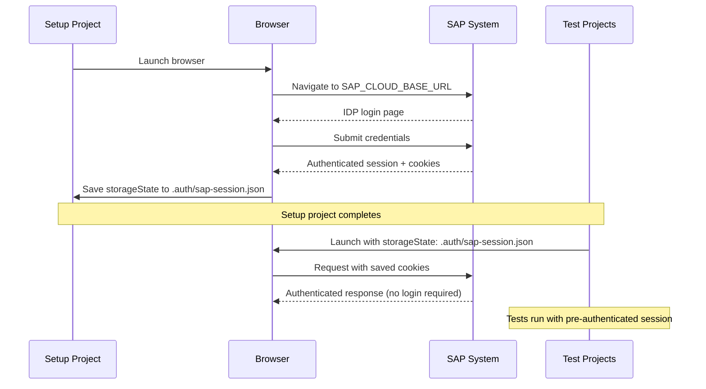

:::info[In this guide]

- Install the Praman SAP testing plugin for Claude Code
- Configure SAP environment variables for authentication
- Set up the Playwright config with auth setup project and bridge injection
- Choose between CLI state-save and seed file approaches for auth state
- Verify the complete installation with a checklist

:::

This guide walks through installing the Praman Claude Code plugin, configuring SAP
credentials, setting up the Playwright auth pipeline, and verifying everything works.

## Prerequisites

| Requirement           | Version / Details                                              |
| --------------------- | -------------------------------------------------------------- |
| **Node.js**           | `>=20`                                                         |
| **@playwright/test**  | `>=1.48.0`                                                     |
| **@playwright/cli**   | Latest (installed globally or via `npx`)                       |
| **playwright-praman** | Latest (`npm install --save-dev playwright-praman`)            |
| **SAP system access** | Base URL, username, password, and network access to the system |
| **Claude Code**       | Latest version with plugin support                             |

Ensure the base packages are installed before proceeding:

```bash
npm install --save-dev playwright-praman @playwright/test
npx playwright install chromium
npm install -g @playwright/cli@latest
```

## Step 1: Install the Plugin

### Claude Code (CLI)

```bash
# Add the marketplace (one-time)
claude plugin marketplace add mrkanitkar/praman-sap-testing

# Install the plugin
claude plugin install praman-sap-testing@praman-sap-testing
```

This registers the plugin with Claude Code and makes the four slash commands available:
`/praman-plan`, `/praman-generate`, `/praman-heal`, and `/praman-coverage`.

### Claude Cowork (Desktop App)

1. Open Claude Desktop and switch to the **Cowork** tab
2. Click **Customize** in the left sidebar
3. Click **Browse plugins**
4. Search for **praman-sap-testing** and click **Install**

For organizations not on the public marketplace, an admin can upload the plugin via
**Organization settings → Plugins → Add plugins → Upload a file**. Download
`praman-sap-testing.zip` from the
[latest release](https://github.com/mrkanitkar/praman-sap-testing/releases/latest).

### Verify

Type `/praman-` in Claude Code or Cowork and autocomplete should show 4 commands.

## Step 2: Configure Environment Variables

Create a `.env.test` file in your project root with SAP credentials. This file is loaded
by Playwright during test execution.

```bash
# .env.test
SAP_CLOUD_BASE_URL=https://my-tenant.s4hana.cloud.sap
SAP_CLOUD_USERNAME=testuser@company.com
SAP_CLOUD_PASSWORD=your-sap-password
SAP_AUTH_STRATEGY=btp-saml
SAP_CLIENT=100
SAP_LANGUAGE=EN
```

### Environment Variables Reference

| Variable             | Required | Default        | Description                                               |
| -------------------- | -------- | -------------- | --------------------------------------------------------- |
| `SAP_CLOUD_BASE_URL` | Yes      | —              | SAP Fiori Launchpad base URL                              |
| `SAP_CLOUD_USERNAME` | Yes      | —              | SAP login username                                        |
| `SAP_CLOUD_PASSWORD` | Yes      | —              | SAP login password                                        |
| `SAP_AUTH_STRATEGY`  | No       | Auto-detect    | Auth strategy: `btp-saml`, `basic`, `office365`, `custom` |
| `SAP_CLIENT`         | No       | System default | SAP client number (e.g., `100`, `200`)                    |
| `SAP_LANGUAGE`       | No       | `EN`           | Display language for the SAP session                      |

If `SAP_AUTH_STRATEGY` is not set, Praman auto-detects based on URL patterns:
`*.cloud.sap` and `*.s4hana.cloud.sap` resolve to `btp-saml`; all other URLs resolve
to `basic`. See the [Authentication Guide](./authentication) for the full decision flowchart.

:::warning[Common mistake]
Using `//` comments in `.env.test` files. The `.env` format only supports `#` for comments.
Lines starting with `//` are parsed as variable names, causing cryptic errors.

```bash
# .env.test — WRONG
// SAP credentials     <-- parsed as a variable, not a comment
SAP_CLOUD_BASE_URL=https://...

# .env.test — CORRECT
# SAP credentials
SAP_CLOUD_BASE_URL=https://...
```

:::

:::warning[Common mistake]
Committing `.env.test` or `sap-auth.json` to version control. These files contain
plaintext credentials. Add them to `.gitignore` immediately:

```bash
# .gitignore
.env.test
.env
sap-auth.json
.auth/
```

Praman's `init` command adds these entries automatically, but verify they are present
if you created the project manually.
:::

## Step 3: Configure Playwright

### Auth Flow

The recommended pattern authenticates once in a setup project and shares the session
across all test projects.



### playwright.config.ts

```typescript
// playwright.config.ts
import { defineConfig, devices } from '@playwright/test';

export default defineConfig({
  testDir: './tests',
  use: {
    baseURL: process.env.SAP_CLOUD_BASE_URL,
    trace: 'on-first-retry',
  },
  projects: [
    // Auth setup — runs first, saves session
    {
      name: 'auth-setup',
      testMatch: /auth\.setup\.ts/,
    },
    // Main test project — depends on auth
    {
      name: 'chromium',
      dependencies: ['auth-setup'],
      use: {
        ...devices['Desktop Chrome'],
        storageState: '.auth/sap-session.json',
      },
    },
    // Agent seed project — raw Playwright auth for MCP pauseAtEnd
    {
      name: 'agent-seed-test',
      testMatch: /sap-seed\.spec\.ts/,
      use: {
        ...devices['Desktop Chrome'],
        headless: false,
      },
    },
  ],
});
```

The `auth-setup` project runs the login flow once. The `chromium` project declares a
dependency on `auth-setup`, so Playwright runs auth first and injects the saved session
into all tests. The `agent-seed-test` project is optional — it runs a raw Playwright
seed file for agent workflows that need `pauseAtEnd` browser access.

## Step 4: Bridge Configuration

The Praman bridge must be injected into CLI browser sessions so agents can discover
UI5 controls. Create the config file at `.playwright/praman-cli.config.json`:

```json
{
  "browser": {
    "browserName": "chromium",
    "launchOptions": {
      "headless": false,
      "channel": "chromium"
    },
    "initScript": ["./node_modules/playwright-praman/dist/browser/praman-bridge-init.js"]
  }
}
```

The `initScript` array tells the CLI to inject the Praman bridge (`window.__praman_bridge`)
into every page. This enables `run-code` discovery of `sap.ui.core.ElementRegistry` and
all bridge-level control operations.

Alternatively, export the bridge script to a local file:

```bash
npx playwright-praman bridge-script --output .playwright/praman-bridge.js
```

Then reference the local copy in the config:

```json
{
  "browser": {
    "initScript": [".playwright/praman-bridge.js"]
  }
}
```

## Step 5: Auth State Setup

Two approaches exist for establishing authenticated state that agents can use.

### Approach A: CLI State-Save

Run the auth setup test, then save the browser state for CLI sessions:

```bash
# Run auth setup to create .auth/sap-session.json
npx playwright test tests/auth.setup.ts

# Save state for CLI sessions
npx @playwright/cli open --config .playwright/praman-cli.config.json "$SAP_CLOUD_BASE_URL"
# (log in manually or let the auth setup handle it)
npx @playwright/cli state-save sap-auth.json
npx @playwright/cli close
```

Agents then load this state at the start of every session:

```bash
npx @playwright/cli state-load sap-auth.json
```

### Approach B: Seed File

Use the seed spec file at `tests/seeds/sap-seed.spec.ts`. This file performs raw Playwright
authentication (no Praman fixtures) and keeps the browser open with `pauseAtEnd` so agents
can attach:

```typescript
// tests/seeds/sap-seed.spec.ts
import { test } from '@playwright/test';

test('SAP seed — authenticate and hold browser open', async ({ page }) => {
  await page.goto(process.env.SAP_CLOUD_BASE_URL!);
  // Raw Playwright login steps (no Praman fixtures)
  await page.fill('#j_username', process.env.SAP_CLOUD_USERNAME!);
  await page.fill('#j_password', process.env.SAP_CLOUD_PASSWORD!);
  await page.click('#logOnFormSubmit');
  await page.waitForURL('**/shell/home');

  // Save state for other projects
  await page.context().storageState({ path: '.auth/sap-session.json' });

  // pauseAtEnd: keep browser open for agent attachment
  await page.pause();
});
```

Run the seed with the `agent-seed-test` project:

```bash
npx playwright test --project=agent-seed-test
```

:::warning[Common mistake]
Forgetting to install CLI browsers separately from `@playwright/test` browsers. The
`@playwright/cli` package uses its own browser binaries. If you see
`browser not found` errors from CLI commands, run:

```bash
npx @playwright/cli install-browser chromium
```

This is separate from `npx playwright install chromium`, which installs browsers for
`@playwright/test`.
:::

## Verification Checklist

Run through this checklist after completing setup. Every item should pass before using
the plugin commands.

| Check                     | Command                                                                 | Expected Result                        |
| ------------------------- | ----------------------------------------------------------------------- | -------------------------------------- |
| Plugin installed          | Type `/praman-` in Claude Code                                          | Autocomplete shows 4 commands          |
| Node.js version           | `node --version`                                                        | `v20.x.x` or higher                    |
| Playwright installed      | `npx playwright --version`                                              | `1.48.0` or higher                     |
| CLI installed             | `npx @playwright/cli --version`                                         | Version number (no error)              |
| npm package installed     | `npm ls playwright-praman`                                              | Package listed with version            |
| Bridge script exists      | `ls node_modules/playwright-praman/dist/browser/praman-bridge-init.js`  | File exists                            |
| CLI config exists         | `ls .playwright/praman-cli.config.json`                                 | File exists                            |
| Env vars set              | `grep SAP_CLOUD_BASE_URL .env.test`                                     | URL present                            |
| Auth state exists         | `ls .auth/sap-session.json`                                             | File exists (after running auth setup) |
| Doctor passes             | `npx playwright-praman doctor`                                          | All checks green                       |
| Bridge loads              | `npx @playwright/cli eval "() => window.__praman_bridge !== undefined"` | `true`                                 |
| Plugin commands available | Type `/praman-` in Claude Code                                          | Autocomplete shows 4 commands          |

## FAQ

<details>
<summary>Do I need both playwright-praman and @playwright/cli?</summary>

Yes, they serve different purposes. `playwright-praman` is the npm package that provides
Praman fixtures (`ui5.control()`, `ui5.press()`, `sapAuth`), the bridge init script, and
the `npx playwright-praman` CLI commands (doctor, snapshot, verify-spec). `@playwright/cli`
is the Playwright terminal interface that agents use to open browsers, run discovery scripts,
take snapshots, and save/load auth state. Both are required for the full plugin workflow.

</details>

<details>
<summary>Can I use a custom authentication strategy?</summary>

Yes. Set `SAP_AUTH_STRATEGY=custom` and register a custom strategy implementation. Custom
strategies must implement the `AuthStrategy` interface (login, logout, isAuthenticated methods).
See the [Authentication Guide](./authentication) for the full custom strategy setup, including
registering the strategy with the `sapAuth` fixture.

</details>

<details>
<summary>How do I verify the plugin loaded correctly?</summary>

Three checks confirm the plugin is active:

1. Typing `/praman-` in Claude Code shows autocomplete for the four commands
2. Running `/praman-plan` with a prompt starts the sap-explorer agent (you will see
   yellow-colored agent output in the Claude Code terminal)

If the plugin does not appear, reinstall with
`claude plugin install praman-sap-testing@praman-sap-testing` and restart Claude Code.

</details>

<details>
<summary>What if my SAP system requires VPN access?</summary>

Connect to the VPN before running any plugin commands. The plugin drives a local browser
that makes HTTP requests to the SAP system, so the browser process must have network access.
For CI/CD environments, configure the VPN connection in your pipeline before the test step.
Praman does not manage VPN connections — it only manages the browser session and auth flow.

</details>

:::tip[Next steps]

- **[Claude Code Plugin Overview →](./claude-code-plugin-overview)** — Understand the full plugin architecture and agent roles
- **[Playwright CLI Agents →](./playwright-cli-agents)** — Learn about the CLI agent alternative
- **[Authentication Guide →](./authentication)** — Deep dive into all 6 auth strategies
- **[Running Your Agent →](./running-your-agent)** — End-to-end walkthrough of agent execution

:::
