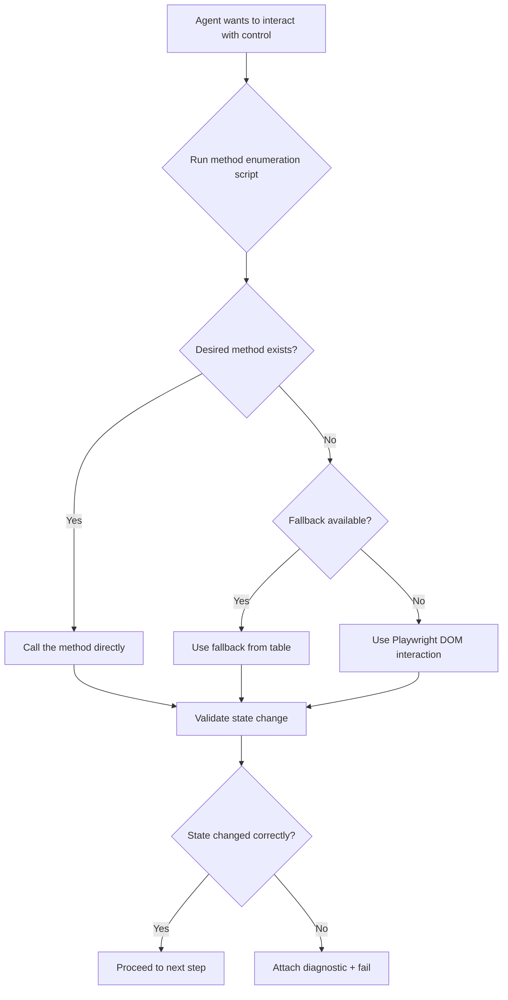

# 7 Mandatory Rules and Rule 0

:::info[In this guide]

- Apply the 8 non-negotiable rules that every Praman-generated SAP test must satisfy
- Use the Rule 0 protocol to verify control methods exist before calling them
- Avoid the most common agent-generated failures (non-existent methods, wrong imports, missing dialogs)
- Understand how rules differ between V2 (SmartField) and V4 (MDC) Fiori Elements
- Run the quick compliance checklist before submitting any generated test

:::

Every test produced by a Praman agent -- whether planner, generator, or healer -- must satisfy
these 8 rules. A single violation fails the quality gate. Rule 0 is listed first because it is
the most frequent cause of agent-generated test failures.

---

## Rule 0: Verify Before You Call

AI agents confidently call methods that do not exist. `press()` on `sap.m.IconTabFilter`,
`setValue()` on `sap.m.ObjectStatus`, `firePress()` on `sap.m.Link` -- all produce runtime
errors that waste healing iterations.

Rule 0 is the antidote: **never call a method on a UI5 control unless you have confirmed it
exists at runtime**.

### The 4-Step Protocol

1. **Identify** -- discover the control's metadata name and ID
2. **Record** -- enumerate all available methods via `run-code`
3. **Interact** -- choose a method from the recorded list (or fall back to DOM click)
4. **Validate** -- confirm the interaction produced the expected state change



### Method Enumeration Script

Run this inside `run-code` to list every method available on a discovered control:

```typescript
// scripts/check-control-methods.ts
playwright-cli -s=sap run-code "async page => {
  return await page.evaluate((controlId) => {
    const control = sap.ui.getCore().byId(controlId);
    if (!control) return { error: 'Control not found', controlId };
    const meta = control.getMetadata();
    const allMethods = Object.getOwnPropertyNames(Object.getPrototypeOf(control))
      .filter(m => typeof control[m] === 'function')
      .sort();
    return {
      controlId,
      controlType: meta.getName(),
      methodCount: allMethods.length,
      interactionMethods: allMethods.filter(m =>
        /^(fire|set|get|press|click|open|close|select|toggle|add|remove)/.test(m)
      ),
      allMethods,
    };
  }, '<CONTROL_ID>');
}"
```

### Fallback Table

When the desired method does not exist, use the correct alternative:

| Control Type             | Wanted Method      | Not Available          | Use Instead                                    |
| ------------------------ | ------------------ | ---------------------- | ---------------------------------------------- |
| `sap.m.IconTabFilter`    | `press()`          | Correct                | `page.getByText('Tab Label').click()`          |
| `sap.m.IconTabFilter`    | `firePress()`      | Correct                | `page.getByText('Tab Label').click()`          |
| `sap.m.ObjectStatus`     | `setValue()`       | Correct                | Read-only -- assert with `getText()`           |
| `sap.m.Link`             | `firePress()`      | Correct                | `page.getByRole('link', { name }).click()`     |
| `sap.ui.comp.SmartField` | `setValue()`       | Correct                | Get inner control, then `setValue()` on it     |
| `sap.m.Select`           | `setSelectedKey()` | Use `getItems()` first | `fireChange({ selectedItem })`                 |
| `sap.m.MultiComboBox`    | `setValue()`       | Correct                | `setSelectedKeys()` or `fireSelectionChange()` |

:::danger[Skipping Rule 0 guarantees test failures]

Without method enumeration, agents generate plausible-looking code that fails at runtime.
The healer then wastes 1-3 iterations discovering the same thing Rule 0 would have caught
in seconds. Every agent run MUST execute the enumeration script before writing interaction
code.

:::

---

## Rule 1: Import Only from `playwright-praman`

Every test file must import `test` and `expect` from `playwright-praman`. Importing from
`@playwright/test` strips all Praman fixtures (`ui5`, `fe`, `ui5Navigation`, `ui5.dialog`).

**Why it exists:** Praman extends Playwright's `test` object with SAP-specific fixtures.
The wrong import compiles fine but fails at runtime with `ui5 is undefined`.

```typescript
// tests/bad-example.spec.ts
import { test, expect } from '@playwright/test'; // WRONG -- no Praman fixtures
```

```typescript
// tests/correct-example.spec.ts
import { test, expect } from 'playwright-praman'; // CORRECT -- all fixtures available
```

:::warning[Common mistake]
TypeScript autocomplete often suggests `@playwright/test` because it appears first
alphabetically. Configure your IDE to prefer `playwright-praman` imports, or add an ESLint
rule to flag the wrong import.
:::

---

## Rule 2: Use Praman Fixtures for All UI5 Elements

All interactions with UI5 controls must use `ui5.press()`, `ui5.fill()`, `ui5.control()`,
or `fe.*` methods. Never use `page.click()`, `page.fill()`, or `page.locator()` for UI5
elements.

**Why it exists:** UI5 controls have complex internal DOM structures. A `page.click('#__button0')`
may click the wrong inner element, and the ID `__button0` is auto-generated and unstable.

```typescript
// tests/bad-example.spec.ts
await page.click('#__button0'); // WRONG -- unstable auto-ID
await page.locator('[id*="__field1"]').fill('1000'); // WRONG -- fragile CSS selector
```

```typescript
// tests/correct-example.spec.ts
await ui5.press({ controlType: 'sap.m.Button', properties: { text: 'Save' } });
await ui5.fill({ controlType: 'sap.m.Input', id: /CompanyCode/ }, '1000');
```

:::warning[Common mistake]
Agents sometimes use `page.click()` with a UI5 ID they discovered via snapshot. Even if the
ID is correct at discovery time, auto-generated IDs like `__button0` change between sessions.
Always use control type + properties or a stable regex ID pattern.
:::

---

## Rule 3: Playwright Native Only for Verified Non-UI5 Elements

`page.click()`, `page.fill()`, and `page.getByRole()` are permitted only for elements that are
confirmed to be outside the UI5 control tree. Every such usage must include a comment explaining
why.

**Why it exists:** Mixing Playwright native interactions with UI5 controls leads to silent
failures -- the DOM click fires but the UI5 event model does not register it.

```typescript
// tests/bad-example.spec.ts
await page.click('[data-sap-ui="button"]'); // WRONG -- UI5 element, no comment
```

```typescript
// tests/correct-example.spec.ts
// Non-UI5: IDP login page is plain HTML, not rendered by UI5
await page.fill('#username', process.env.SAP_CLOUD_USERNAME!);
await page.fill('#password', process.env.SAP_CLOUD_PASSWORD!);
await page.click('#submit-button');
```

:::warning[Common mistake]
FLP Space Tabs (`sap.m.IconTabFilter`) are UI5 controls but lack `press()`/`firePress()`.
This is a Rule 0 fallback, not a Rule 3 violation. The comment should reference Rule 0:
`// Rule 0 fallback: IconTabFilter has no press() -- DOM click required`.
:::

---

## Rule 4: Auth in Seed, Never in Test Body

Authentication must be handled by the seed test or setup project. Never call `sapAuth.login()`
or write login code inside a test body.

**Why it exists:** Login code in every test wastes 15-30 seconds per test, creates flaky IDP
timeouts, and duplicates credentials handling across files.

```typescript
// tests/bad-example.spec.ts
test('create purchase order', async ({ page, sapAuth }) => {
  await sapAuth.login('user', 'password'); // WRONG -- auth in test body
  await ui5Navigation.navigateToIntent({ semanticObject: 'PurchaseOrder', action: 'create' });
});
```

```typescript
// tests/correct-example.spec.ts
// Auth handled by setup project dependency in playwright.config.ts:
//   { name: 'e2e', dependencies: ['setup'], use: { storageState: '.auth/sap-session.json' } }
test('create purchase order', async ({ ui5, ui5Navigation, fe }) => {
  await ui5Navigation.navigateToIntent({ semanticObject: 'PurchaseOrder', action: 'create' });
});
```

:::warning[Common mistake]
Agents sometimes add `sapAuth.login()` as a "safety net" even when `storageState` is configured.
This causes a double-login that breaks the session. If auth state is expired, re-run the seed
instead of adding login code to the test.
:::

---

## Rule 5: setValue + fireChange + waitForUI5 for Every Input

Every input interaction must follow the three-step sequence: set the value, fire the change
event, and wait for UI5 to process the event. Skipping any step causes silent data loss.

**Why it exists:** UI5 input controls do not read DOM `value` directly. `setValue()` updates
the model, `fireChange()` triggers validation and dependent field updates, and `waitForUI5()`
ensures all async handlers complete before the next interaction.

```typescript
// tests/bad-example.spec.ts
await ui5.fill({ id: /Supplier/ }, '100001');
// WRONG -- no fireChange, no waitForUI5; dependent fields may not update
```

```typescript
// tests/correct-example.spec.ts
await ui5.fill({ id: /Supplier/ }, '100001');
// Praman's fill() internally calls setValue + fireChange + waitForUI5
// If using low-level bridge calls, you must do all three:
await ui5.bridge.setValue(control, '100001');
await ui5.bridge.fireChange(control);
await ui5.waitForUI5();
```

:::warning[Common mistake]
When using `ui5.fill()`, the three-step sequence is automatic. But when agents use bridge
methods directly (e.g., during healing), they often forget `fireChange()`. The value appears
in the field but dependent fields like descriptions and value helps do not update.
:::

---

## Rule 6: searchOpenDialogs for Dialog Controls

Any control interaction inside a dialog must include `searchOpenDialogs: true` in the selector.
Without it, the control finder searches the main page and either finds nothing or finds the
wrong control.

**Why it exists:** UI5 renders dialogs in a separate DOM subtree (`sap-ui-static`). The default
control search scope does not include this subtree.

```typescript
// tests/bad-example.spec.ts
const confirmBtn = await ui5.control({
  controlType: 'sap.m.Button',
  properties: { text: 'Confirm' },
  // WRONG -- missing searchOpenDialogs, will not find button in dialog
});
```

```typescript
// tests/correct-example.spec.ts
const confirmBtn = await ui5.control({
  controlType: 'sap.m.Button',
  properties: { text: 'Confirm' },
  searchOpenDialogs: true, // CORRECT -- searches dialog DOM subtree
});
```

:::warning[Common mistake]
Value help dialogs (`sap.ui.comp.valuehelpdialog.ValueHelpDialog`) are dialogs too. Agents
often forget `searchOpenDialogs: true` when selecting rows inside a value help because the
value help "feels" like part of the main page.
:::

---

## Rule 7: TSDoc Compliance Header

Every generated test file must include a TSDoc compliance header with `@description`,
`@capability`, `@intent`, and `@license` tags.

**Why it exists:** The header enables automated traceability from test to business requirement,
supports capability-based test selection, and satisfies the Apache-2.0 license header
enforcement (`eslint-plugin-headers`).

```typescript
// tests/bad-example.spec.ts
// No header -- fails eslint-plugin-headers and verify-spec
import { test, expect } from 'playwright-praman';
```

```typescript
// tests/correct-example.spec.ts
/**
 * @description Create Purchase Order - E2E test for PO creation with 2 line items
 * @capability sap.mm.purchaseOrder.create
 * @intent Verify end-to-end PO creation workflow including header, items, and save
 * @license Apache-2.0
 */
import { test, expect } from 'playwright-praman';
```

:::warning[Common mistake]
Using JSDoc-style `@param` and `@returns` tags in test file headers instead of the required
Praman tags (`@capability`, `@intent`). Test files are not library functions -- they need
business traceability tags, not API documentation tags.
:::

---

## V2 vs V4: How Rules Differ

Rules 2, 5, and 6 behave differently depending on whether the Fiori app uses V2
(SmartField / `sap.ui.comp`) or V4 (MDC / `sap.ui.mdc`) controls.

### Rule 2: Control Type Suffixes

| V2 (`sap.ui.comp`)                            | V4 (`sap.ui.mdc`)             |
| --------------------------------------------- | ----------------------------- |
| `sap.ui.comp.smartfield.SmartField`           | `sap.ui.mdc.Field`            |
| `sap.ui.comp.smarttable.SmartTable`           | `sap.ui.mdc.Table`            |
| `sap.ui.comp.smartfilterbar.SmartFilterBar`   | `sap.ui.mdc.FilterBar`        |
| `sap.ui.comp.valuehelpdialog.ValueHelpDialog` | `sap.ui.mdc.valuehelp.Dialog` |

### Rule 5: Input Sequence Differences

| Aspect             | V2 SmartField                        | V4 MDC Field                          |
| ------------------ | ------------------------------------ | ------------------------------------- |
| Set value          | Get inner control, then `setValue()` | Direct `setValue()` on MDC Field      |
| Fire change        | `fireChange()` on inner control      | `fireChange()` on MDC Field           |
| Value help trigger | `fireValueHelpRequest()`             | Open via `valueHelpIconPress()`       |
| Dependent fields   | Immediate after `fireChange()`       | May require additional `waitForUI5()` |

### Rule 6: Dialog Patterns

| Aspect            | V2                                            | V4                                        |
| ----------------- | --------------------------------------------- | ----------------------------------------- |
| Value help dialog | `sap.ui.comp.valuehelpdialog.ValueHelpDialog` | `sap.ui.mdc.valuehelp.Dialog`             |
| Action parameter  | Custom dialog from controller                 | `fe::APD_::` prefixed generated dialog    |
| Confirm button ID | Application-defined                           | `fe::APD_::${SRVD}.${Action}::Action::Ok` |

---

## Quick Compliance Checklist

Run through this checklist before submitting any generated test:

- [ ] **Rule 0**: Method enumeration script was run for every discovered control
- [ ] **Rule 1**: `import { test, expect } from 'playwright-praman'` -- no other import source
- [ ] **Rule 2**: All UI5 interactions use `ui5.*` or `fe.*` -- no `page.click('#__...')`
- [ ] **Rule 3**: Every `page.*` call has a comment explaining why it is non-UI5
- [ ] **Rule 4**: No `sapAuth.login()` or login code in the test body
- [ ] **Rule 5**: Every input uses `ui5.fill()` or the explicit 3-step sequence
- [ ] **Rule 6**: Every dialog interaction includes `searchOpenDialogs: true`
- [ ] **Rule 7**: TSDoc header with `@description`, `@capability`, `@intent`, `@license`

---

## FAQ

<details>
<summary>Can I ever use page.click() on a UI5 control?</summary>

Yes, but only as a Rule 0 fallback when the control lacks the expected interaction method.
The canonical example is `sap.m.IconTabFilter`, which has no `press()` or `firePress()`.
In this case, use `page.getByText('Tab Label').click()` with a comment:
`// Rule 0 fallback: IconTabFilter has no press()`. The quality gate accepts this pattern
when the comment is present.

</details>

<details>
<summary>What if a control has no stable ID?</summary>

Use the selector priority order: binding path first, then properties, then regex ID. If none
of these produce a unique match, combine `controlType` + `properties` + `ancestor`:

```typescript
await ui5.control({
  controlType: 'sap.m.Input',
  ancestor: {
    controlType: 'sap.uxap.ObjectPageSection',
    properties: { title: 'Header Data' },
  },
});
```

Avoid exact auto-generated IDs like `__input0` -- they change between sessions and UI5
versions.

</details>

<details>
<summary>How does the auto-fix loop handle rule violations?</summary>

The healer agent runs `npx playwright-praman verify-spec` after every generation or fix.
If violations are found, it reads the violation report, applies targeted fixes, and re-runs
verification. This loop runs up to 3 iterations. If violations persist after 3 iterations,
the healer reports the remaining issues and stops -- it does not produce an infinite loop
of fixes.

</details>

<details>
<summary>Do these rules apply to unit tests too?</summary>

No. These 8 rules apply only to E2E and integration tests that interact with a live SAP system
through the Praman bridge. Unit tests (`*.test.ts`) that mock the bridge can use any Vitest
pattern. The quality gate (`verify-spec`) only scans `.spec.ts` files.

</details>

:::tip[Next steps]

- **[19 Forbidden Patterns](./claude-code-plugin-forbidden-patterns.md)** -- zero-tolerance patterns and their correct alternatives
- **[Gold Standard Test Pattern](./gold-standard-test.md)** -- complete reference test demonstrating all rules in action
- **[Control Interactions](./control-interactions.md)** -- detailed reference for `ui5.*` methods
- **[Debugging Agent Failures](./debugging-agent-failures.md)** -- troubleshooting when generated tests fail

:::
