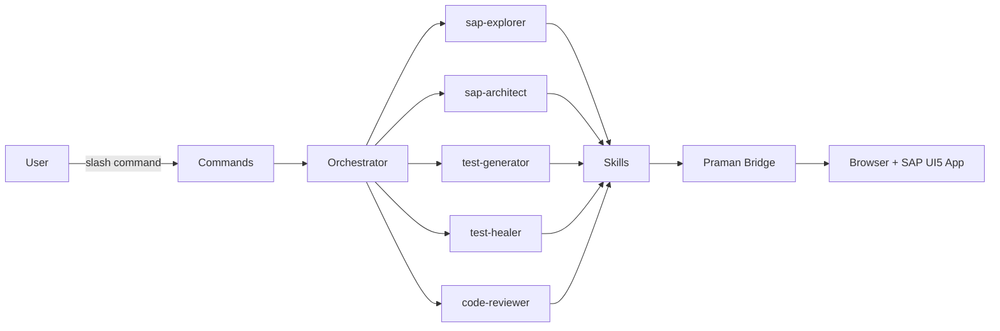
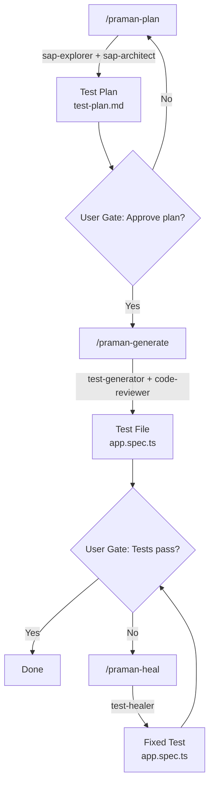

:::info[In this guide]

- Understand what the Praman Claude Code plugin is and why it exists
- See how 5 agents, 4 commands, and 8 skills compose a test automation pipeline
- Learn the architecture from user command to browser interaction
- Choose between the plugin, CLI agents, and MCP agents for your workflow
- Walk through the plan-generate-heal pipeline with user gates

:::

The **Praman Claude Code Plugin** is an agent-first SAP UI5 test automation system that runs
inside Claude Code. It packages 5 specialized AI agents, 4 slash commands, 8 skill files,
7 mandatory rules, and 19 forbidden patterns into a single installable plugin. The plugin
orchestrates the full test lifecycle: explore a live SAP Fiori app, produce a test plan,
generate gold-standard Playwright tests, and heal failures automatically.

## Architecture

The plugin sits between you and the browser. Slash commands dispatch work to an orchestrator,
which selects the right agent. Each agent reads skill files for domain knowledge and drives
the browser through the Praman bridge.

**Flow**: You issue a command (e.g., `/praman-plan`). The orchestrator picks the right agent
(e.g., sap-explorer). That agent reads its skill files for SAP control patterns, bridge
commands, and forbidden patterns. It then drives the browser through the Praman bridge to
discover controls, generate tests, or heal failures.

## Plugin Components

### 5 Agents

Each agent has a dedicated role, model assignment, and color for visual identification in logs.

| Agent              | Model  | Color  | Role                                                        |
| ------------------ | ------ | ------ | ----------------------------------------------------------- |
| **sap-explorer**   | Sonnet | Yellow | Explore live SAP app, discover UI5 controls, capture state  |
| **sap-architect**  | Sonnet | Blue   | Design test plan from discovered controls and app structure |
| **test-generator** | Sonnet | Green  | Generate gold-standard `.spec.ts` from test plan            |
| **test-healer**    | Opus   | Red    | Debug and fix failing tests using live browser inspection   |
| **code-reviewer**  | Sonnet | Purple | Validate generated tests against mandatory rules            |

The test-healer uses Opus (the most capable model) because diagnosing failures requires
deeper reasoning about control state, timing, and selector ambiguity.

### 4 Commands

| Command            | Pipeline Stage | Description                                    |
| ------------------ | -------------- | ---------------------------------------------- |
| `/praman-plan`     | Plan           | Explore SAP app and produce a structured plan  |
| `/praman-generate` | Generate       | Convert plan into Praman-compliant test code   |
| `/praman-heal`     | Heal           | Fix failing tests by inspecting live app state |
| `/praman-coverage` | Full pipeline  | Run plan + generate + heal end-to-end          |

### 8 Skills, 7 Rules, 19 Forbidden Patterns

| Category               | Count | Examples                                                                  |
| ---------------------- | ----- | ------------------------------------------------------------------------- |
| **Skills**             | 8     | SAP UI5 controls, bridge commands, FLP navigation, dialog handling, OData |
| **Mandatory rules**    | 7     | `import from 'playwright-praman'` only, Praman fixtures for all UI5, etc. |
| **Forbidden patterns** | 19    | `page.click('#__...')`, `page.waitForTimeout()`, raw `@playwright/test`   |

Skills are `.md` files that agents read before taking action. They contain control-type
references, discovery snippets, `run-code` patterns, and code templates.

## Plugin vs CLI Agents vs MCP Agents

Three approaches exist for AI-driven SAP test automation with Praman. They can coexist in
the same project.

| Aspect                 | Plugin                                       | CLI Agents                          | MCP Agents                              |
| ---------------------- | -------------------------------------------- | ----------------------------------- | --------------------------------------- |
| **Installation**       | `claude plugin install` via marketplace      | `.md` files in `.claude/agents/`    | `@playwright/mcp` server in `.mcp.json` |
| **Shared rules**       | Yes (plugin enforces 7 rules, 19 patterns)   | No (each agent file is standalone)  | No (rules embedded per-agent)           |
| **Command pipeline**   | Yes (`/praman-coverage` chains all stages)   | Manual (run each agent separately)  | Manual (invoke MCP tools individually)  |
| **Session hooks**      | Yes (pre/post hooks for auth, cleanup)       | No                                  | No                                      |
| **Skill distribution** | Bundled (agents auto-read from plugin root)  | Per-project (`skills/` directory)   | Embedded in MCP server config           |
| **Model control**      | Per-agent model assignment in plugin config  | Set in agent frontmatter            | Determined by MCP client                |
| **Browser control**    | Via Praman bridge (same as CLI)              | `@playwright/cli` shell commands    | MCP tool calls (`browser_click`, etc.)  |
| **Token efficiency**   | Moderate (structured orchestration overhead) | High (compact CLI commands)         | Lower (JSON-RPC protocol overhead)      |
| **Best for**           | Teams wanting a governed pipeline            | Individual developers, CI scripting | IDEs with native MCP support            |

### When to Use Each

- **Plugin**: You want enforced rules, a single command to run the full pipeline, and shared
  configuration across all agents. Best for teams and governed workflows.
- **CLI Agents**: You want lightweight, per-project agent files with maximum token efficiency.
  Best for individual developers and CI pipelines.
- **MCP Agents**: Your IDE has native MCP support and you want tool-call-based browser
  interaction. Best for VS Code Copilot and Cursor with MCP extensions.

:::warning[Common mistake]
Trying to use plugin commands (`/praman-plan`, `/praman-generate`) without installing the
plugin first. These commands are not available until you install the plugin via the marketplace
(see [Installation](./claude-code-plugin-installation)).
If you only have CLI agent `.md` files in `.claude/agents/`, use the CLI commands instead
(`/praman-cli-plan`, `/praman-cli-generate`).
:::

:::warning[Common mistake]
Confusing the plugin with CLI agent `.md` files. The plugin is a structured package with
an orchestrator, shared rules, and session hooks. CLI agents are standalone Markdown files
that Claude Code reads as agent definitions. Both can coexist, but they are invoked
differently: plugin commands start with `/praman-`, CLI agent commands start with `/praman-cli-`.
:::

## Pipeline Overview

The plugin runs a three-stage pipeline with user gates between each stage. You review and
approve before the next stage begins.

### Stage 1: Plan (`/praman-plan`)

The **sap-explorer** agent opens the SAP app in a browser, authenticates, navigates through
the application, and discovers all UI5 controls. The **sap-architect** agent then structures
these discoveries into a test plan with control IDs, types, bindings, and interaction sequences.

**Output**: `test-plan.md` + `gold-standard.spec.ts` (reference implementation)

### Stage 2: Generate (`/praman-generate`)

The **test-generator** agent reads the approved plan and produces a Praman-compliant `.spec.ts`
file. The **code-reviewer** agent validates the output against all 7 mandatory rules and
19 forbidden patterns before presenting it to you.

**Output**: `app.spec.ts` (validated, ready to run)

### Stage 3: Heal (`/praman-heal`)

If tests fail, the **test-healer** agent runs the failing test with `--debug=cli`, attaches
to the browser session, inspects live page state at the failure point, and fixes selectors,
timing, or logic issues. The healer iterates until all tests pass or reports an unresolvable
issue.

**Output**: `app.spec.ts` (fixed)

### Full Pipeline (`/praman-coverage`)

Runs all three stages in sequence with automatic user gates. Equivalent to running `/praman-plan`,
then `/praman-generate`, then `/praman-heal` — but without manually invoking each command.

## FAQ

Can I use the plugin alongside CLI agents?

Yes. The plugin and CLI agents coexist in the same project. Plugin commands (`/praman-plan`)
and CLI agent commands (`/praman-cli-plan`) are separate invocations. You might use the plugin
for governed team workflows and CLI agents for quick individual exploration. Both produce
identical `.spec.ts` output using Praman fixtures.

Does the plugin require an MCP server?

No. The plugin drives the browser through the Praman bridge and `@playwright/cli` shell
commands. It does not require `@playwright/mcp` or any MCP server configuration. However,
if you also have MCP agents configured in `.mcp.json`, they will continue to work independently.

What models do the agents use?

Four of the five agents (sap-explorer, sap-architect, test-generator, code-reviewer) use
**Sonnet** for fast, cost-efficient operation. The **test-healer** uses **Opus** because
diagnosing test failures requires deeper reasoning about control state, timing edge cases,
and selector disambiguation. Model assignments are configured in the plugin and can be
overridden in the plugin settings.

What happens if I run /praman-coverage and a stage fails?

The pipeline pauses at user gates between stages. If the plan stage produces an incomplete
plan, you can reject it and re-run. If generated tests fail, the healer stage activates
automatically. If the healer cannot resolve a failure after its retry limit, it reports the
unresolved issue with diagnostic details (control state, snapshot, suggested manual fixes)
so you can intervene.

:::tip[Next steps]

- **[Plugin Installation and Setup →](./claude-code-plugin-installation)** — Install the plugin, configure credentials, and verify your setup
- **[Playwright CLI Agents →](./playwright-cli-agents)** — Learn about the CLI agent alternative
- **[Getting Started →](./getting-started)** — Install Praman and run your first test

:::
