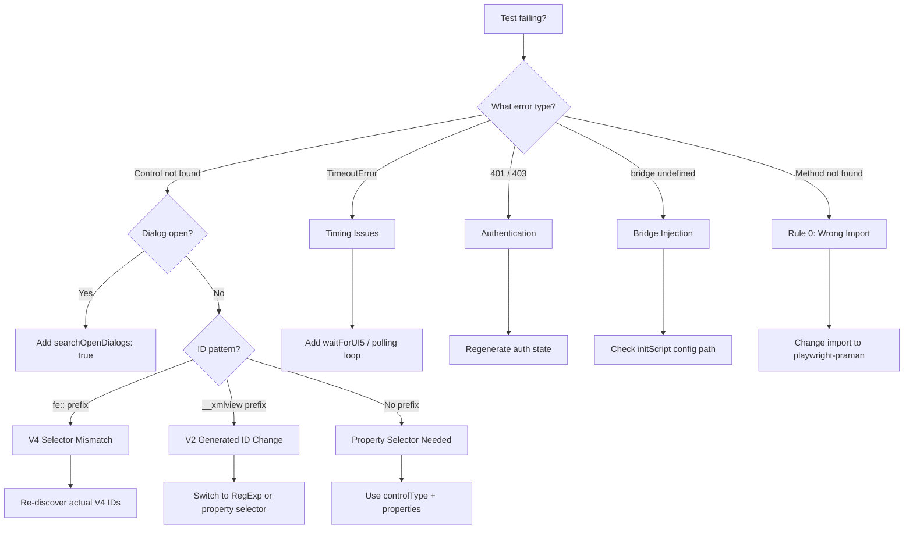

# Plugin Troubleshooting

:::info[In this guide]

- Diagnose test failures using a structured flowchart that maps errors to root causes
- Fix bridge injection failures, authentication errors, and selector mismatches
- Resolve timing issues without using `page.waitForTimeout()`
- Handle V2/V4 OData version mismatches in generated test code
- Debug FLP navigation failures for Spaces, Tiles, and WorkZone iframes

:::

## Diagnostic Flowchart

Start here when any Praman test fails. Follow the branches to the correct resolution section.



## Quick Error Lookup

| Error Message                        | Cause                                | Fix                                                       |
| ------------------------------------ | ------------------------------------ | --------------------------------------------------------- |
| `Control not found: fe::APD_::...`   | V4 FE ID changed between versions    | Re-discover IDs with explorer; update IDS map             |
| `Control not found: __xmlview0--...` | V2 generated ID prefix changed       | Use RegExp ID (`/materialInput/`) instead of exact        |
| `searchOpenDialogs required`         | Control is inside an open dialog     | Add `searchOpenDialogs: true` to the selector             |
| `TimeoutError: locator.click`        | UI5 not stable, control not rendered | Add `await ui5.waitForUI5()` before interaction           |
| `bridge is not defined`              | Praman bridge not injected into page | Check `initScript` path in CLI config                     |
| `sap is not defined`                 | Page loaded before UI5 bootstrapped  | Wait for UI5 ready state before discovery                 |
| `401 Unauthorized`                   | Session expired or credentials wrong | Regenerate `sap-auth.json` with fresh login               |
| `403 Forbidden`                      | User lacks authorization for the app | Check SAP role assignments for test user                  |
| `Method press not found on control`  | Control type has no `press()` method | Use DOM click via Playwright native (e.g., IconTabFilter) |
| `strict mode violation`              | Multiple controls match the selector | Add more specific properties, ID, or ancestor             |
| `net::ERR_CONNECTION_REFUSED`        | SAP system not reachable             | Verify `SAP_CLOUD_BASE_URL` and network access            |
| `frame detached`                     | WorkZone iframe navigated away       | Re-acquire frame reference after navigation               |

## Bridge Injection Failures

### Symptoms

- `bridge is not defined` in test output
- `ui5.control()` calls throw immediately without waiting
- Discovery scripts return empty results

### Diagnosis Script

Run this in a CLI session to check bridge and SAP state:

```typescript title="diagnosis: check bridge + sap + version"
// Run via: playwright-cli -s=sap run-code "async page => { ... }"
return await page.evaluate(() => {
  return {
    bridgeLoaded: typeof window.__praman_bridge__ !== 'undefined',
    sapLoaded: typeof window.sap !== 'undefined',
    ui5Version: window.sap?.ui?.version ?? 'not loaded',
    coreReady: typeof window.sap?.ui?.getCore === 'function',
  };
});
```

### Causes and Fixes

| Cause                          | Fix                                                                             |
| ------------------------------ | ------------------------------------------------------------------------------- |
| Missing `initScript` in config | Add `initScript` path to `.playwright/praman-cli.config.json`                   |
| Wrong config path              | Verify `--config=.playwright/praman-cli.config.json` on `open` command          |
| CSP blocking script injection  | Add Praman bridge domain to CSP `script-src` in SAP system config               |
| Page not fully loaded          | Wait for `sap.ui.getCore().isInitialized()` before bridge calls                 |
| Bridge script file missing     | Run `npx playwright-praman bridge-script --output .playwright/praman-bridge.js` |

```json title=".playwright/praman-cli.config.json"
{
  "browser": {
    "initScript": {
      "path": ".playwright/praman-bridge.js"
    }
  }
}
```

:::warning[Common mistake]

Do not assume the bridge loads instantly. The `initScript` injects the bridge before any page
JavaScript runs, but SAP UI5 bootstraps asynchronously. Always call `await ui5.waitForUI5()`
after navigation before attempting any control discovery or interaction. Calling
`ui5.control()` before UI5 is ready produces `sap is not defined`, not a bridge error.

:::

## Authentication Issues

### Session Expired

SAP sessions typically expire after 30-60 minutes of inactivity. Symptoms:

- Tests pass on first run but fail on subsequent runs
- `401 Unauthorized` responses in network tab
- Redirect to SAP login page mid-test

**Fix**: Regenerate the auth state file:

```bash
# Re-run the seed test to capture fresh auth
npx playwright test --project=agent-seed-test
# Or manually save state from a CLI session
playwright-cli -s=sap state-save sap-auth.json
```

### Wrong Authentication Strategy

| Env Var `SAP_AUTH_STRATEGY` | Expected System            | Symptoms if Wrong                         |
| --------------------------- | -------------------------- | ----------------------------------------- |
| `cloud-idp`                 | S/4HANA Cloud (IAS/IDP)    | Timeout on login form that does not exist |
| `basic`                     | On-premise with Basic Auth | Redirect loop to IDP login page           |
| `saml`                      | BTP with SAML SSO          | 403 after apparent successful login       |

**Fix**: Check which IDP your system uses and set `SAP_AUTH_STRATEGY` accordingly in `.env`.

### Missing Environment Variables

```bash title=".env"
# All three are required
SAP_CLOUD_BASE_URL=https://your-system.s4hana.cloud.sap/
SAP_CLOUD_USERNAME=your-sap-user
SAP_CLOUD_PASSWORD=your-sap-password

# Optional but recommended
SAP_AUTH_STRATEGY=cloud-idp
```

If any are missing, the seed test fails silently and produces an empty `sap-auth.json`.
Check the file size: a valid state file is typically 5-50 KB. An empty or sub-1 KB file
indicates failed authentication.

## Selector Issues

### Dialog Context Missing

**Symptom**: `Control not found` for a control that is visually present inside a dialog.

**Cause**: By default, `ui5.control()` searches only the main page DOM. Controls inside
open dialogs (value help, action parameter dialogs, confirmation popups) require explicit
dialog context.

**Fix**: Add `searchOpenDialogs: true`:

```typescript
// Before (fails when control is in a dialog)
const btn = await ui5.control({
  id: 'fe::APD_::SRVD.CreateBOM::Action::Ok',
});

// After (searches dialog DOM first)
const btn = await ui5.control({
  id: 'fe::APD_::SRVD.CreateBOM::Action::Ok',
  searchOpenDialogs: true,
});
```

### Generated IDs Changing

V2 apps use view-prefixed IDs like `__xmlview0--materialInput` that change when the view
hierarchy changes. V4 FE apps use SRVD-based IDs that are stable but include long namespace
prefixes.

**Fix for V2**: Use RegExp IDs that match the suffix:

```typescript
// Brittle — breaks if view prefix changes
await ui5.control({ id: '__xmlview0--materialInput' });

// Resilient — matches any view prefix
await ui5.control({ id: /materialInput/ });
```

**Fix for V4**: Use the full `fe::` prefixed ID with the SRVD constant:

```typescript
const SRVD = 'com.sap.gateway.srvd.zui_purchaseorder_m_v4.v0001';

await ui5.control({
  id: `fe::APD_::${SRVD}.CreatePurchaseOrder::Supplier-inner`,
  searchOpenDialogs: true,
});
```

### V2/V4 Mismatch

**Symptom**: Generated test uses V4 `fe::` IDs but the app is V2 (or vice versa).

**Cause**: The explorer detected the wrong OData version, or the app uses a mixed V2/V4
architecture.

**Fix**: Detect the version explicitly before generating IDs:

```typescript title="diagnosis: detect OData version"
return await page.evaluate(() => {
  const mdcTable = document.querySelector('[data-sap-ui-type="sap.ui.mdc.Table"]');
  const compTable = document.querySelector(
    '[data-sap-ui-type="sap.ui.comp.smarttable.SmartTable"]',
  );
  return {
    hasV4MDC: mdcTable !== null,
    hasV2Comp: compTable !== null,
    recommendation: mdcTable ? 'V4 — use fe:: IDs' : 'V2 — use RegExp IDs',
  };
});
```

## Timing Issues

### Flaky Tests

**Symptom**: Test passes 70% of the time, fails with `TimeoutError` intermittently.

**Cause**: Missing `waitForUI5()` calls between interactions. UI5 processes events
asynchronously, and the next interaction may fire before the previous one completes.

**Fix**: Add `waitForUI5()` after every state-changing interaction:

```typescript
await ui5.setValue(control, '1000');
await ui5.fireChange(control);
await ui5.waitForUI5(); // Wait for UI5 to process the change
```

### Value Help Data Not Loaded

**Symptom**: Value help dialog opens but the table is empty or the expected row is missing.

**Cause**: OData request for value help data has not completed when the test tries to select
a row.

**Fix**: Use a polling loop instead of a fixed timeout:

```typescript
let targetRow;
for (let attempt = 0; attempt < 10; attempt++) {
  try {
    targetRow = await ui5.control({
      controlType: 'sap.m.ColumnListItem',
      ancestor: { controlType: 'sap.m.Table' },
      searchOpenDialogs: true,
    });
    break;
  } catch {
    await ui5.waitForUI5();
  }
}
expect(targetRow).toBeDefined();
```

:::warning[Common mistake]

Never use `page.waitForTimeout(5000)` to fix timing issues. It is banned by Praman Rule 8
and makes tests slow and unreliable. A 5-second wait that works locally may be too short in
CI and too long for fast systems. Always use `waitForUI5()` or a polling loop with retry
logic. The polling loop exits as soon as the condition is met, making tests both faster and
more reliable.

:::

### Strict Mode Violation

**Symptom**: `strict mode violation: locator resolved to N elements` where N > 1.

**Cause**: The selector matches multiple controls on the page. Playwright's strict mode
requires exactly one match.

**Fix**: Make the selector more specific:

```typescript
// Too broad — matches every Button on the page
await ui5.control({ controlType: 'sap.m.Button' });

// Specific — matches only the Save button in the footer
await ui5.control({
  controlType: 'sap.m.Button',
  properties: { text: 'Save' },
  ancestor: { controlType: 'sap.m.Toolbar', id: /footerToolbar/ },
});
```

## FLP Navigation Issues

### Hash Not Changing

**Symptom**: `navigateToIntent()` completes but the app does not load.

**Cause**: The FLP hash changed but the shell did not fire the `UIUpdated` event, so
navigation appears to succeed without actually loading the target app.

**Fix**: Wait for the FLP `UIUpdated` event after navigation:

```typescript
await ui5Navigation.navigateToIntent({
  semanticObject: 'PurchaseOrder',
  action: 'display',
});
await ui5.waitForUI5(); // Waits for UIUpdated internally
```

### WorkZone Iframe

**Symptom**: Controls visible in the browser but `ui5.control()` cannot find them.

**Cause**: SAP BTP WorkZone loads Fiori apps inside an iframe. Praman's default context
searches the top-level frame only.

**Fix**: Switch frame context before interacting with app controls:

```typescript
await test.step('switch to WorkZone app iframe', async () => {
  const appFrame = page.frameLocator('iframe[id*="application"]');
  // Use the frame-aware Praman context
  await ui5.switchToFrame(appFrame);
});
```

## Plugin Issues

### Command Not Found

**Symptom**: `/praman-coverage` or `/praman-sap-plan` not recognized by Claude Code.

**Fix**: Install the plugin agents:

```bash
npx playwright-praman init-agents --loop=claude
```

Verify the agent files exist:

```bash
ls .claude/agents/praman-sap-*.md
```

### Skills Not Loading

**Symptom**: Agent runs but produces raw Playwright code instead of Praman fixtures.

**Cause**: The skill file at `skills/playwright-praman-sap-testing/SKILL.md` is not readable
or was not installed.

**Fix**: Restart Claude Code to reload skill files. If the file is missing, reinstall:

```bash
npx playwright-praman init
```

### Agent Model

The Praman agents work with any Claude model but are optimized for Claude Opus and Sonnet.
The `model:` field in agent frontmatter controls which model is used. If generation quality
is low, verify the agent file specifies an appropriate model.

:::warning[Common mistake]

Do not assume all UI5 controls have a `press()` method. `sap.m.IconTabFilter` is a notable
exception -- it has no `press()` or `firePress()`. Use Playwright native DOM click instead:

```typescript
// Wrong — IconTabFilter has no press()
await ui5.press(
  await ui5.control({
    controlType: 'sap.m.IconTabFilter',
    properties: { key: 'details' },
  }),
);

// Correct — use Playwright native click
await page.getByText('Details', { exact: true }).click();
```

This is one of the few cases where Playwright native interaction is correct for a UI5 control.

:::

## FAQ

<details>
<summary>Bridge works locally but not in CI?</summary>

Common causes:

1. **Missing `initScript` file in CI artifacts** — The bridge script at
   `.playwright/praman-bridge.js` must be generated before tests run. Add
   `npx playwright-praman bridge-script --output .playwright/praman-bridge.js` to your CI
   pipeline before the test step.

2. **CSP headers differ between environments** — Production or staging SAP systems may have
   stricter Content Security Policy headers that block injected scripts. Work with your SAP
   Basis team to allowlist the bridge script origin.

3. **Different browser versions** — CI may use a different Chromium version than local. Run
   `npx playwright install chromium` in CI to ensure the correct version.

</details>

<details>
<summary>How do I debug what the agent is doing?</summary>

Three approaches, from least to most detailed:

1. **Read the pipeline output** — Each agent logs its actions to the Claude Code conversation.
   Scroll up to see discovery results, selector decisions, and heal diagnoses.

2. **Inspect saved snapshots** — The planner saves `.yml` snapshots at each step. Read them
   with `cat flp-snapshot.yml` to see exactly what the agent saw.

3. **Attach to the debug session** — Run the test with `--debug=cli` and use
   `playwright-cli attach` to inspect the live browser state at the failure point. The healer
   does this automatically, but you can do it manually for deeper investigation.

</details>

<details>
<summary>Tests pass individually but fail when run in parallel?</summary>

SAP systems are stateful. Two tests creating purchase orders simultaneously may conflict on
document number sequences, lock the same material master record, or exceed the user's
session limit.

**Fix**: Run SAP tests sequentially with `workers: 1` in `playwright.config.ts`:

```typescript
export default defineConfig({
  workers: 1, // Sequential execution for SAP
});
```

If you need parallelism, use separate SAP test users per worker and ensure tests operate on
different business objects.

</details>

:::tip[Next steps]

- **[Debugging →](./debugging.md)** — Playwright trace viewer, screenshots, and video recording for SAP tests
- **[Authentication →](./authentication.md)** — Complete guide to SAP auth strategies and session management
- **[End-to-End Walkthrough →](./claude-code-plugin-walkthrough.md)** — Full pipeline walkthrough from plan to passing tests

:::
