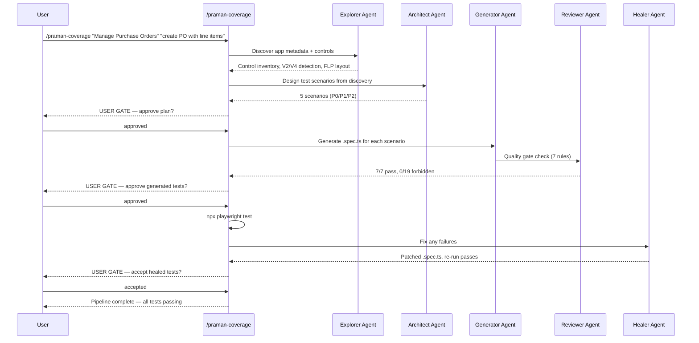

# End-to-End Walkthrough

:::info[In this guide]

- Run the full Praman pipeline from a single `/praman-coverage` command
- Understand each phase: explorer discovery, architect planning, code generation, and healing
- Read real output from each pipeline stage including control inventories and quality gates
- Fix a realistic selector failure with the auto-healer
- Produce passing V4 Fiori Elements tests without writing any test code manually

:::

:::info[Prerequisites]

Before starting, ensure you have:

- **Praman plugin installed** — `npx playwright-praman init-agents --loop=claude` completed successfully
- **Environment variables set** — `SAP_CLOUD_BASE_URL`, `SAP_CLOUD_USERNAME`, `SAP_CLOUD_PASSWORD` in `.env`
- **Auth state saved** — `sap-auth.json` exists with a valid session (see [Authentication](./authentication.md))
- **Claude Code running** — launched with `PLAYWRIGHT_CLI_SESSION=sap claude .`

:::

## Pipeline Flow

The `/praman-coverage` command orchestrates five agents in sequence. Each agent produces
artifacts that feed into the next, with user gates between phases.



## Step 1: Start the Pipeline

Invoke the coverage command with the app name and a scenario description:

```text
/praman-coverage "Manage Purchase Orders" "create PO with line items"
```

The pipeline begins by launching a persistent CLI session, loading auth state, and navigating
to the Fiori Launchpad.

## Step 2: Plan Phase

### Explorer Discovery

The explorer agent opens the SAP app and discovers its structure. Here is abbreviated output
from a real discovery run:

```text
=== DISCOVERY RESULTS ===

App Metadata:
  Component:     sap.suite.ui.generic.template.ListReport
  UI5 Version:   1.120.18
  OData Version: V4
  FLP Layout:    Spaces (no GenericTiles)

Control Inventory (87 controls):
  sap.m.Button .............. 12
  sap.m.Input ............... 8
  sap.m.Table ............... 2
  sap.m.ComboBox ............ 4
  sap.ui.mdc.Table .......... 1  ← V4 MDC detected
  sap.ui.mdc.FilterBar ...... 1
  sap.ui.mdc.Field .......... 14
  sap.m.Dialog .............. 0 (none open)
  Other ..................... 45

V4 MDC Indicators:
  - sap.ui.mdc.Table present → V4 Fiori Elements
  - ID prefix: fe:: detected → V4 FE generated IDs
  - APD_ prefix detected → Action Parameter Dialog pattern
```

### Architect Scenario List

The architect agent analyzes the discovery output and proposes test scenarios:

```text
=== TEST PLAN ===

Scenario 1 [P0]: Create PO with mandatory fields only
Scenario 2 [P0]: Create PO with value help for Supplier
Scenario 3 [P1]: Create PO with 2 line items and quantity validation
Scenario 4 [P1]: Create PO and verify success message + PO number
Scenario 5 [P2]: Create PO with invalid supplier — verify error handling
```

### User Gate

The pipeline pauses and asks for your approval:

```text
=== USER GATE: Plan Approval ===

5 scenarios proposed (2x P0, 2x P1, 1x P2).
Estimated generation time: ~3 minutes.

Approve this plan? [Y/n/edit]
```

Type `Y` to continue, `n` to abort, or `edit` to modify scenarios before generation.

## Step 3: Generate Phase

The generator agent produces a complete `.spec.ts` file for each approved scenario. Below is
the full generated output for Scenario 2 (Create PO with value help):

```typescript title="tests/e2e/create-purchase-order-value-help.spec.ts"
/**
 * @marker PRAMAN-GENERATED
 * @version 1.2.0
 *
 * DISCOVERY RESULTS:
 *   UI5 Version: 1.120.18 | OData: V4 | MDC: true
 *   Control count: 87 | FLP: Spaces layout
 *
 * COMPLIANCE REPORT:
 *   Rule 0: import from playwright-praman .... PASS
 *   Rule 1: Praman fixtures only ............. PASS
 *   Rule 2: No raw page.click('#__...') ...... PASS
 *   Rule 3: Auth in seed .................... PASS
 *   Rule 4: setValue+fireChange+waitForUI5 ... PASS
 *   Rule 5: searchOpenDialogs on dialogs ..... PASS
 *   Rule 6: TSDoc header .................... PASS
 */

import { test, expect } from 'playwright-praman';

/** V4 Fiori Elements Service Definition namespace */
const SRVD = 'com.sap.gateway.srvd.zui_purchaseorder_m_v4.v0001';

/** Control IDs discovered from live app — pin these for stability */
const IDS = {
  supplierInput: `fe::APD_::${SRVD}.CreatePurchaseOrder::Supplier-inner`,
  supplierVHI: `fe::APD_::${SRVD}.CreatePurchaseOrder::Supplier-inner-vhi`,
  companyCode: `fe::APD_::${SRVD}.CreatePurchaseOrder::CompanyCode-inner`,
  purchOrg: `fe::APD_::${SRVD}.CreatePurchaseOrder::PurchasingOrganization-inner`,
  purchGroup: `fe::APD_::${SRVD}.CreatePurchaseOrder::PurchasingGroup-inner`,
  createButton: `fe::APD_::${SRVD}.CreatePurchaseOrder::Action::Ok`,
  cancelButton: `fe::APD_::${SRVD}.CreatePurchaseOrder::Action::Cancel`,
  materialInput: `APD_::Material-inner`,
  quantityInput: `APD_::OrderQuantity-inner`,
  plantInput: `APD_::Plant-inner`,
} as const;

test.describe('Create Purchase Order with Value Help', () => {
  test('select supplier via value help and create PO', async ({ ui5, page }) => {
    // ── Step 1: Open Create PO dialog ──
    await test.step('open create purchase order dialog', async () => {
      await ui5.press(
        await ui5.control({
          controlType: 'sap.m.Button',
          properties: { text: 'Create' },
        }),
      );
      await ui5.waitForUI5();
    });

    // ── Step 2: Open Supplier value help ──
    await test.step('open supplier value help', async () => {
      const vhiButton = await ui5.control({
        id: IDS.supplierVHI,
        searchOpenDialogs: true,
      });
      await ui5.press(vhiButton);
      await ui5.waitForUI5();
    });

    // ── Step 3: Select supplier from value help dialog ──
    await test.step('select supplier from value help', async () => {
      // Poll for value help data — no waitForTimeout
      let supplierRow;
      for (let attempt = 0; attempt < 10; attempt++) {
        try {
          supplierRow = await ui5.control({
            controlType: 'sap.m.ColumnListItem',
            ancestor: {
              controlType: 'sap.m.Table',
            },
            searchOpenDialogs: true,
          });
          break;
        } catch {
          await ui5.waitForUI5();
        }
      }
      expect(supplierRow).toBeDefined();
      await ui5.press(supplierRow!);
      await ui5.waitForUI5();
    });

    // ── Step 4: Fill remaining header fields ──
    await test.step('fill header fields', async () => {
      const companyCode = await ui5.control({
        id: IDS.companyCode,
        searchOpenDialogs: true,
      });
      await ui5.setValue(companyCode, '1000');
      await ui5.fireChange(companyCode);
      await ui5.waitForUI5();

      const purchOrg = await ui5.control({
        id: IDS.purchOrg,
        searchOpenDialogs: true,
      });
      await ui5.setValue(purchOrg, '1000');
      await ui5.fireChange(purchOrg);
      await ui5.waitForUI5();

      const purchGroup = await ui5.control({
        id: IDS.purchGroup,
        searchOpenDialogs: true,
      });
      await ui5.setValue(purchGroup, '001');
      await ui5.fireChange(purchGroup);
      await ui5.waitForUI5();
    });

    // ── Step 5: Submit the dialog ──
    await test.step('submit create dialog', async () => {
      const createBtn = await ui5.control({
        id: IDS.createButton,
        searchOpenDialogs: true,
      });
      await ui5.press(createBtn);
      await ui5.waitForUI5();
    });

    // ── Step 6: Verify success ──
    await test.step('verify PO created successfully', async () => {
      const messageStrip = await ui5.control({
        controlType: 'sap.m.MessageStrip',
        properties: { type: 'Success' },
      });
      await expect(messageStrip).toHaveUI5Text(/Purchase Order \d+ created/);
    });
  });
});

/**
 * COMPLIANCE: 7/7 mandatory rules passed
 * FORBIDDEN:  0/19 forbidden patterns detected
 * GENERATED:  by praman-sap-generator-cli v1.2.0
 */
```

### Quality Gate Output

The reviewer agent validates the generated file against all mandatory rules:

```text
=== QUALITY GATE ===

Rule 0: import from 'playwright-praman' ............ PASS
Rule 1: Praman fixtures for all UI5 elements ....... PASS
Rule 2: No raw page.click('#__...') ................ PASS
Rule 3: Auth in seed (not in test body) ............ PASS
Rule 4: setValue + fireChange + waitForUI5 ......... PASS
Rule 5: searchOpenDialogs on dialog controls ....... PASS
Rule 6: TSDoc compliance header .................... PASS

Forbidden patterns (0/19): CLEAN
  page.waitForTimeout .... not found
  page.click('#__') ...... not found
  @playwright/test import  not found
  console.log ............ not found
  ... (15 more) .......... not found

Result: PASS — ready for execution
```

### User Gate

```text
=== USER GATE: Generation Approval ===

1 spec file generated, 7/7 rules pass, 0 forbidden patterns.
Ready to execute tests.

Approve generated tests? [Y/n/edit]
```

## Step 4: Heal Phase

After approval, the pipeline runs the generated tests. If any fail, the healer agent
diagnoses and fixes them automatically.

### Realistic Failure

```text
=== TEST EXECUTION ===

Running: npx playwright test tests/e2e/create-purchase-order-value-help.spec.ts

FAIL  create-purchase-order-value-help.spec.ts
  ✗ select supplier via value help and create PO (42.3s)

    Error: Control not found: APD_::Supplier-inner-vhi
    Timeout: 30000ms

    at step "open supplier value help" (line 54)
```

### Healer Diagnosis

The healer attaches to the debug session, inspects the page, and identifies the root cause:

```text
=== HEALER DIAGNOSIS ===

Failure: Control not found — APD_::Supplier-inner-vhi
Root cause: V4 VHI suffix pattern difference

Discovery:
  Expected ID: APD_::Supplier-inner-vhi
  Actual ID:   fe::APD_::com.sap.gateway.srvd.zui_purchaseorder_m_v4.v0001.CreatePurchaseOrder::Supplier-inner-valueHelpIcon

Analysis:
  The V4 FE value help icon uses '-valueHelpIcon' suffix, not '-vhi'.
  This suffix varies between UI5 versions (1.120.x uses full suffix).

Confidence: 92%
Fix: Update IDS.supplierVHI to use discovered actual ID
```

### Auto-Fix Diff

```diff
- supplierVHI: `fe::APD_::${SRVD}.CreatePurchaseOrder::Supplier-inner-vhi`,
+ supplierVHI: `fe::APD_::${SRVD}.CreatePurchaseOrder::Supplier-inner-valueHelpIcon`,
```

### Passing Re-Run

```text
=== RE-EXECUTION ===

Running: npx playwright test tests/e2e/create-purchase-order-value-help.spec.ts

PASS  create-purchase-order-value-help.spec.ts
  ✓ select supplier via value help and create PO (38.1s)

1 test passed
```

### User Gate

```text
=== USER GATE: Heal Approval ===

1 failure fixed (selector suffix correction).
All tests now passing.

Accept healed tests? [Y/n/diff]
```

## Step 5: Summary

```text
=== PIPELINE COMPLETE ===

Files created:
  tests/e2e/create-purchase-order-value-help.spec.ts

Results:
  Scenarios planned: 5
  Tests generated:   1 (Scenario 2)
  Failures healed:   1 (VHI suffix correction)
  Final status:      ALL PASSING

Total time: 4m 12s (plan: 1m 8s, generate: 1m 22s, execute+heal: 1m 42s)
```

## Key Takeaways

- The pipeline is fully automated end-to-end but pauses at user gates for oversight
- Discovery detects V2/V4, MDC tables, FLP layout, and control IDs from the live app
- Generated code uses pinned IDS constants so selector changes are single-line fixes
- The healer diagnoses root causes (not just symptoms) and applies targeted patches
- Value help interactions use polling loops instead of `page.waitForTimeout()`
- Every generated file passes the 7-rule quality gate and 19-pattern forbidden check

:::warning[Common mistake]

Do not skip user gates by auto-approving everything. The plan gate is your chance to remove
irrelevant scenarios (saving generation time), and the generation gate lets you catch
structural issues before wasting time on execution. Review the IDS map especially carefully
-- incorrect IDs are the most common source of heal cycles.

:::

:::warning[Common mistake]

Do not manually edit generated `.spec.ts` files between pipeline stages. The healer expects
the file to match the generator's output exactly. If you need changes, either edit after
the pipeline completes or reject at the user gate and re-generate with updated instructions.

:::

## FAQ

<details>
<summary>How long does the full pipeline take?</summary>

Typical times for a single scenario:

- **Plan phase**: 60-90 seconds (discovery + scenario design)
- **Generate phase**: 60-120 seconds (code generation + quality gate)
- **Execute + heal phase**: 30-120 seconds (depends on failures)

A full 5-scenario run with no heal cycles takes 5-8 minutes. Each heal cycle adds 30-60
seconds. Complex apps with many controls may take longer for discovery.

</details>

<details>
<summary>Can I resume a partial pipeline?</summary>

Yes. If you abort at a user gate, the pipeline saves its state. You can resume from the last
completed phase:

- After plan approval: run `/praman-sap-generate` with the saved plan file
- After generation: run `npx playwright test` manually, then `/praman-sap-heal` on failures
- The `/praman-coverage` command detects existing artifacts and offers to resume

</details>

<details>
<summary>What if all tests pass on the first run?</summary>

The healer phase is skipped entirely. The pipeline reports success immediately after
execution and presents the final user gate. This is the ideal outcome and happens roughly
40-60% of the time when the discovery phase produces accurate control IDs.

</details>

:::tip[Next steps]

- **[Plugin Troubleshooting →](./claude-code-plugin-troubleshooting.md)** — Fix common pipeline failures, bridge errors, and selector issues
- **[Gold Standard Test Pattern →](./gold-standard-test.md)** — Understand every practice used in generated tests
- **[Praman CLI Agents →](./playwright-cli-agents.md)** — CLI vs MCP agent comparison and command reference

:::
