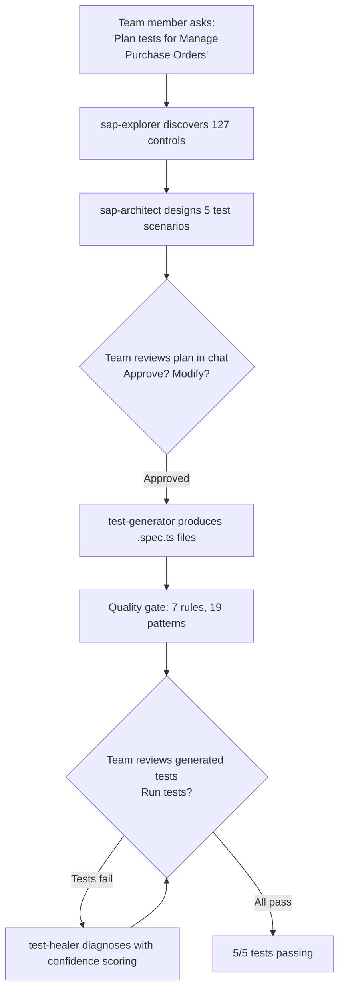

:::info[In this guide]

- Install the Praman plugin in Claude Cowork via the Customize menu
- Understand how the same 5-agent pipeline works in a chat-first interface
- Run plan-generate-heal through natural language requests
- Collaborate with your team on test reviews and approvals
- Know the differences between the Claude Code and Claude Cowork plugins

:::

The **Praman Claude Cowork Plugin** brings the same 5-agent SAP test automation pipeline to
Claude Cowork. Same agents, same 7 mandatory rules, same 19 forbidden patterns, same
confidence-scored healing — but with a chat-first interface designed for team collaboration.

## Claude Cowork vs Claude Code

Both plugins share identical internals. The difference is the interface and collaboration model.

| Aspect            | Claude Code Plugin              | Claude Cowork Plugin                     |
| ----------------- | ------------------------------- | ---------------------------------------- |
| **Interface**     | Terminal / CLI                  | Chat / conversational                    |
| **Installation**  | `claude plugin install` via CLI | GUI: Customize → Browse plugins          |
| **Invocation**    | Slash commands (`/praman-plan`) | Natural language requests                |
| **Collaboration** | Single user                     | Team-visible sessions                    |
| **Review**        | User gates in terminal          | Collaborative review in chat             |
| **Best for**      | Developers, CI pipelines        | Teams, business analysts, shared reviews |

:::tip
If you're already familiar with the [Claude Code Plugin](/docs/guides/claude-code-plugin-overview),
everything about agents, skills, rules, and forbidden patterns applies identically here.
This guide focuses on installation, the chat-first workflow, and team collaboration features.
:::

## Installation

### Prerequisites

Before installing, ensure your project has:

- **Node.js** 20+ LTS
- **Playwright** 1.48+ (`npm install -D @playwright/test`)
- **@playwright/cli** installed globally (`npm install -g @playwright/cli@latest`)
- **playwright-praman** npm package installed (`npm install -D playwright-praman`)
- Access to a running **SAP system** (S/4HANA, BTP, or other Fiori-enabled)

### Environment Variables

Set these in your project's `.env.test` or environment:

```bash
export SAP_CLOUD_BASE_URL="https://your-sap-system.example.com"
export SAP_CLOUD_USERNAME="your-username"
export SAP_CLOUD_PASSWORD="your-password"
```

### Install the Plugin

1. Open Claude Desktop and switch to the **Cowork** tab
2. Click **Customize** in the left sidebar
3. Click **Browse plugins**
4. Search for **praman-sap-testing** and click **Install**

For organizations not on the public marketplace, an admin can upload the plugin:

1. Download `praman-sap-testing.zip` from the
   [latest release](https://github.com/mrkanitkar/praman-sap-testing/releases/latest)
2. Go to **Organization settings → Plugins → Add plugins → Upload a file**
3. Select the downloaded `.zip` file

Verify the plugin loaded by asking:

```text
What Praman agents and skills are available?
```

Cowork should list all 5 agents and 8 skills.

### Auth State Setup

Save authenticated browser state so agents can skip the login flow during test generation:

```bash
# Open a persistent browser session
playwright-cli -s=sap open "$SAP_CLOUD_BASE_URL" --persistent

# Log in manually through the SAP IDP page
# Then save the auth state
playwright-cli -s=sap state-save sap-auth.json
```

The `sap-auth.json` file stores cookies and storage state. Agents load it automatically
before each browser interaction.

## Using the Plugin

### Chat-First Invocation

Unlike Claude Code where you use slash commands, in Cowork you describe what you want in
natural language. The plugin's skill routing activates the right agents automatically.

| Instead of...                           | Say this in Cowork                              |
| --------------------------------------- | ----------------------------------------------- |
| `/praman-plan "Manage Purchase Orders"` | "Plan tests for the Manage Purchase Orders app" |
| `/praman-generate test-plan.md`         | "Generate Playwright tests from the test plan"  |
| `/praman-heal tests/e2e/`               | "Fix the failing tests in the e2e directory"    |
| `/praman-coverage "My App"`             | "Plan, generate, and heal tests for My App"     |

The agents, rules, and quality gates execute identically regardless of how you invoke them.

### The Pipeline in Cowork

The same three-stage pipeline runs with collaborative user gates:



#### Phase 1: Plan

Ask Cowork to plan tests for your SAP app:

```text
Plan tests for "Manage Purchase Orders" — focus on creating a PO
with supplier value help and line items.
```

The **sap-explorer** agent opens the app, discovers controls, and maps navigation flows.
The **sap-architect** agent designs test scenarios with priorities (P0/P1/P2). You see
the plan in the chat and can discuss it with your team before approving.

#### Phase 2: Generate

Once the plan is approved:

```text
Generate the tests from the plan.
```

The **test-generator** agent produces `.spec.ts` files following the gold standard:
`import from 'playwright-praman'`, V4 MDC IDS constants, `searchOpenDialogs: true`,
polling loops instead of `waitForTimeout`, and `waitForUI5()` after every mutation.

The **quality gate** automatically scans every file for all 19 forbidden patterns and
verifies all 7 mandatory rules. Only compliant files are presented.

#### Phase 3: Heal

If tests fail on first run:

```text
The create-with-vh test is failing with "Control not found: APD_::Supplier-inner-vhi".
Fix it.
```

The **test-healer** agent (powered by Opus) diagnoses the failure with confidence scoring:

| Confidence | Action                        |
| ---------- | ----------------------------- |
| 90-100     | Auto-applied                  |
| 70-89      | Auto-applied with explanation |
| Below 70   | Presented for team review     |

## Team Collaboration

### Shared Visibility

In Cowork, every pipeline stage is visible to all team members in the session:

- **Plan reviews** — the team sees discovered controls, proposed scenarios, and can suggest
  changes before generation begins
- **Generated code** — test files are visible in chat for collaborative review
- **Heal decisions** — low-confidence fixes are presented to the team for discussion rather
  than auto-applied

### Collaborative Review Workflow

```text
Team Lead: "Plan tests for the Manage Purchase Orders app"
→ Explorer discovers 127 controls, Architect proposes 5 scenarios

QA Engineer: "Add a scenario for deleting a line item — we had a regression there last sprint"
→ Architect adds P1 scenario #6

Team Lead: "Approved. Generate the tests."
→ Generator produces 6 .spec.ts files, quality gate passes all 6

QA Engineer: "Run them against the QAS system"
→ 5/6 pass, 1 failure on supplier VH icon selector

Test-healer: "Confidence 92 — VHI suffix uses double-dash on this system. Auto-fixing."
→ 6/6 pass after healing
```

### When to Use Cowork vs Code

| Scenario                                   | Recommended          |
| ------------------------------------------ | -------------------- |
| Solo developer writing tests               | Claude Code Plugin   |
| Team reviewing test strategy               | Claude Cowork Plugin |
| CI/CD pipeline integration                 | Claude Code Plugin   |
| Business analyst validating coverage       | Claude Cowork Plugin |
| Debugging a single failing test            | Claude Code Plugin   |
| Onboarding new team members to SAP testing | Claude Cowork Plugin |

## What You Get

The Cowork plugin includes everything from the Claude Code plugin:

| Component              | Count | Details                                                                             |
| ---------------------- | ----- | ----------------------------------------------------------------------------------- |
| **Agents**             | 5     | Explorer, Architect, Generator, Healer, Reviewer                                    |
| **Skills**             | 8     | CLI syntax, auth, controls, Fiori Elements, OData, navigation, bridge, verification |
| **Mandatory Rules**    | 7     | Import source, fixtures, non-UI5, auth isolation, input sequence, dialogs, TSDoc    |
| **Rule 0**             | 1     | Control method verification before every interaction                                |
| **Forbidden Patterns** | 19    | Zero-tolerance patterns scanned by the quality gate                                 |

For detailed documentation on each component, see:

- **[Agents and Skills](/docs/guides/claude-code-plugin-agents-skills)** — how each agent works
- **[7 Mandatory Rules](/docs/guides/claude-code-plugin-mandatory-rules)** — compliance rules with examples
- **[19 Forbidden Patterns](/docs/guides/claude-code-plugin-forbidden-patterns)** — zero-tolerance list
- **[End-to-End Walkthrough](/docs/guides/claude-code-plugin-walkthrough)** — full pipeline example

:::warning[Common mistake]
Asking Cowork to generate tests without first setting up `sap-auth.json`. The agents need
authenticated browser state to access your SAP system. Without it, the explorer agent will
fail at the login screen. Run the auth state setup before your first planning session.
:::

:::warning[Common mistake]
Expecting different test output between Code and Cowork. Both plugins produce identical
`.spec.ts` files following the same gold standard. The only difference is the interface —
how you invoke the pipeline and review results.
:::

## Troubleshooting

<details>
<summary>Plugin not appearing in Browse plugins?</summary>

If the plugin is not listed in the marketplace, install it manually:

1. Download `praman-sap-testing.zip` from the
   [latest release](https://github.com/mrkanitkar/praman-sap-testing/releases/latest)
2. Ask your organization admin to upload it via
   **Organization settings → Plugins → Add plugins → Upload a file**

The `.zip` must contain `.claude-plugin/plugin.json`, `agents/`, `skills/`, and `commands/`
at the root level. Note: Cowork's upload dialog accepts `.zip` files only — if you have a
`.plugin` file, rename it to `.zip` before uploading.

</details>

<details>
<summary>Agents not activating when I describe a task?</summary>

Be specific in your request. Instead of "help me test", say "Plan tests for the Manage
Purchase Orders app" or "Generate Playwright tests from this test plan". The skill routing
activates based on keywords like "plan tests", "generate tests", "fix failing tests",
"SAP", "UI5 controls", etc.

</details>

<details>
<summary>Can I use both Code and Cowork plugins in the same project?</summary>

Yes. Both plugins read from the same project files (`sap-auth.json`, `playwright.config.ts`,
test plans, generated specs). You can plan in Cowork with your team and then heal individual
failures in Claude Code. The generated test files are identical and interchangeable.

</details>

<details>
<summary>How do I update the Cowork plugin?</summary>

If the plugin is in a marketplace, go to **Customize → Browse plugins** and check for
updates. For manual uploads, download the latest `.zip` from the
[releases page](https://github.com/mrkanitkar/praman-sap-testing/releases/latest)
and re-upload via **Organization settings → Plugins → Add plugins → Upload a file**.

</details>

:::tip[Next steps]

- **[Plugin Installation](/docs/guides/claude-code-plugin-installation)** — Detailed setup for auth, playwright config, and bridge
- **[End-to-End Walkthrough](/docs/guides/claude-code-plugin-walkthrough)** — Complete pipeline example with real output
- **[Mandatory Rules](/docs/guides/claude-code-plugin-mandatory-rules)** — Understand Rule 0 and the 7 compliance rules
- **[Troubleshooting](/docs/guides/claude-code-plugin-troubleshooting)** — Common errors and diagnostic steps

:::
