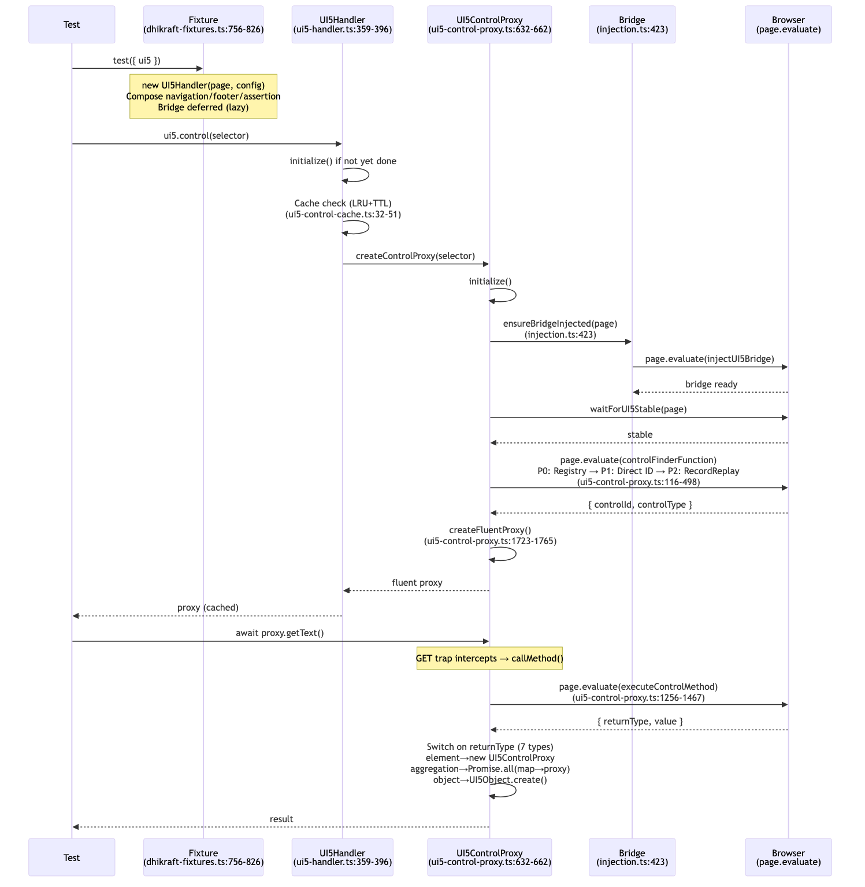
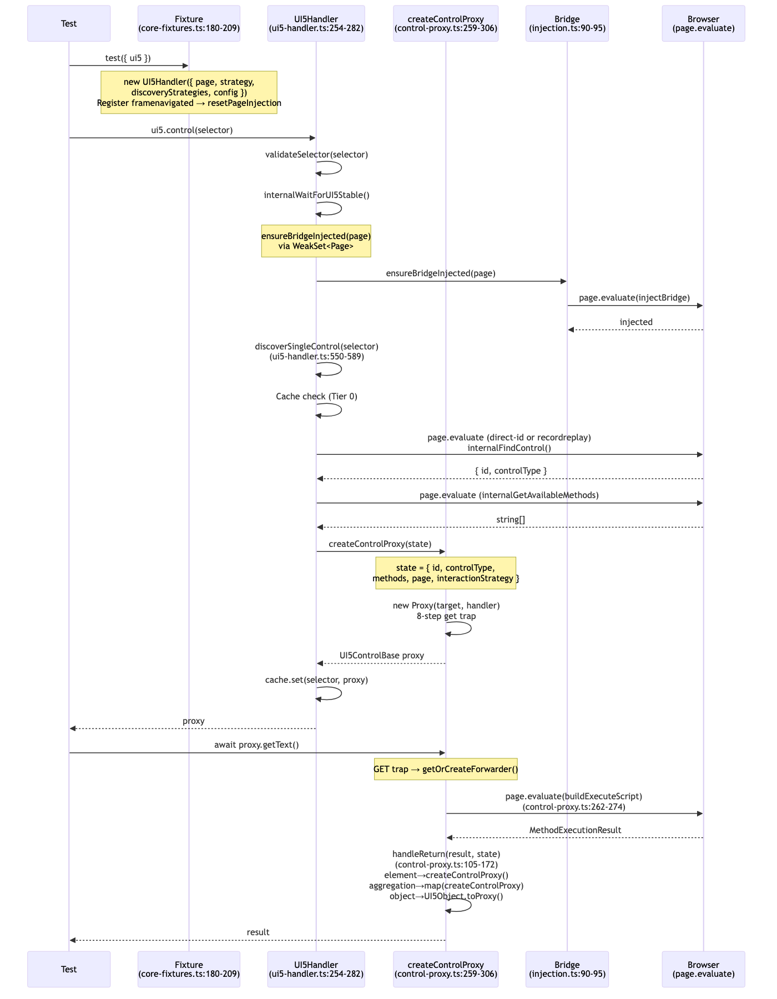
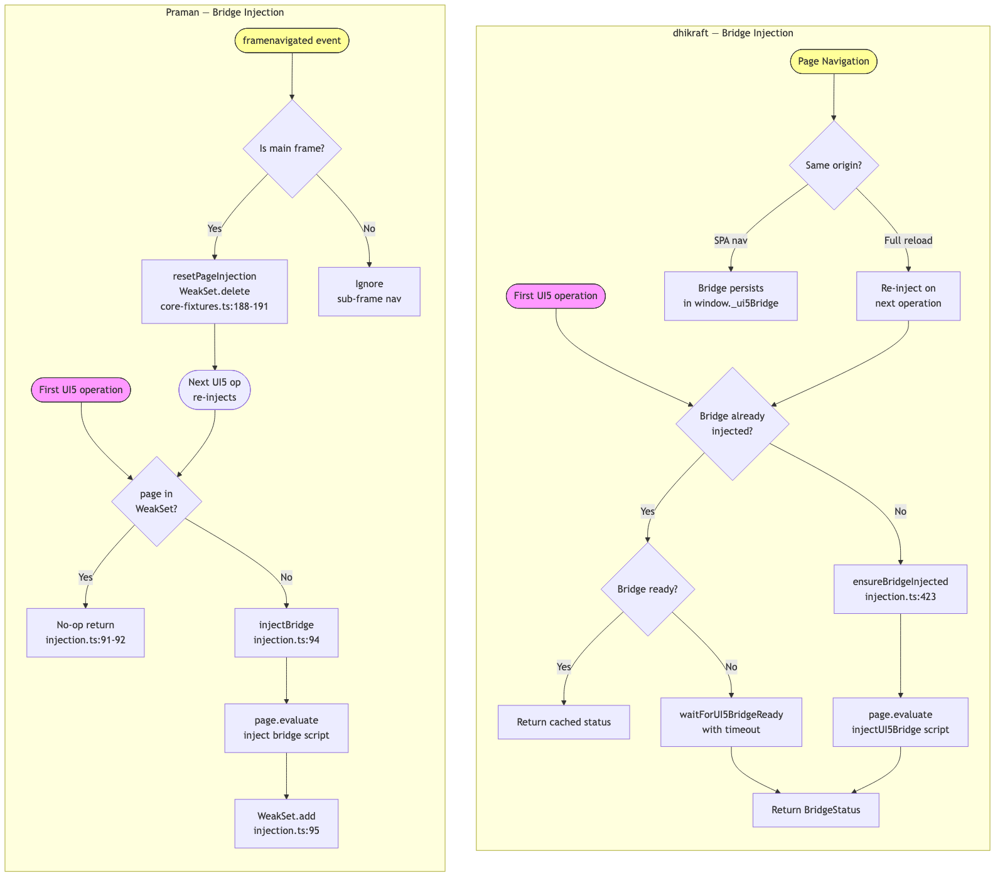
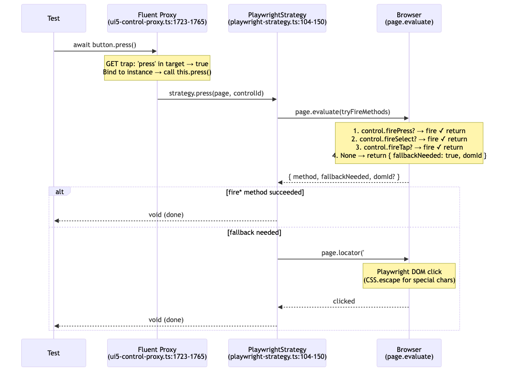
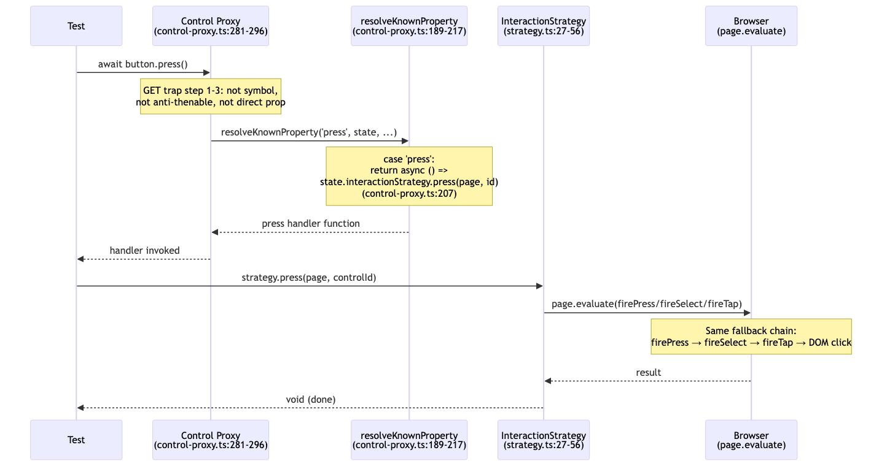
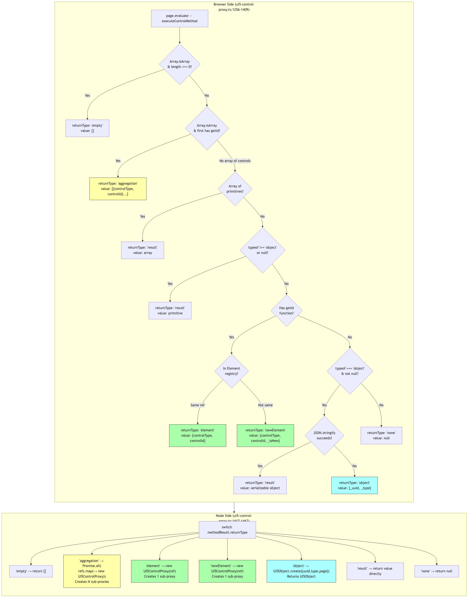
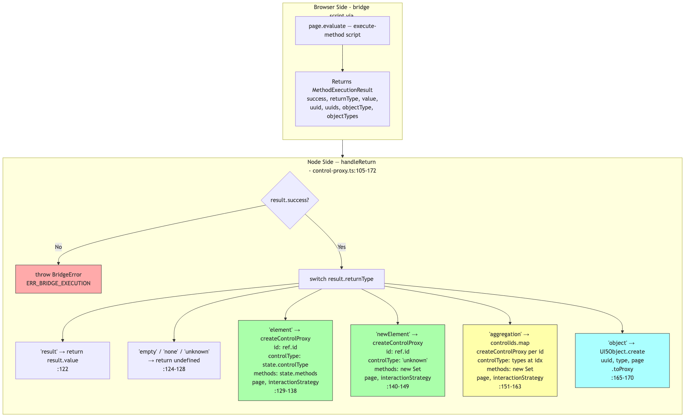
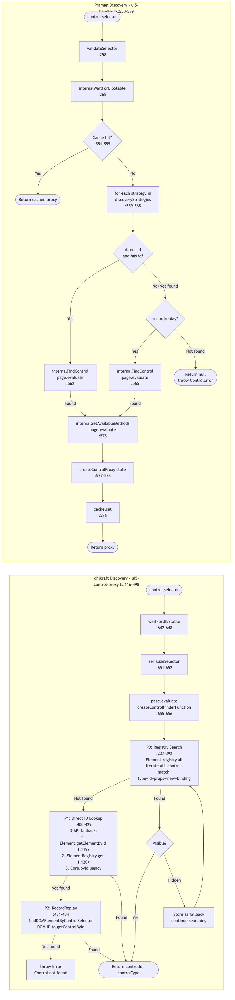
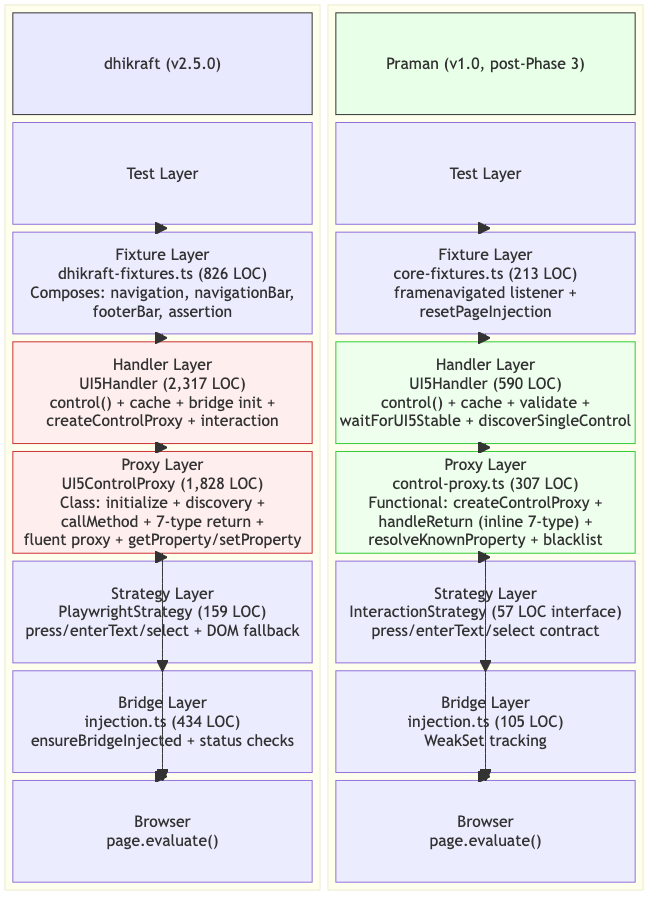
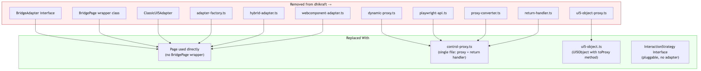

# Architecture Comparison: dhikraft vs Praman

This document provides diagrams comparing the dhikraft (v2.5.0)
and Praman (v1.0, post-Phase 3 simplification) architectures. Each diagram includes
exact `file:line` references from the respective codebases.

**Repositories:**

- **dhikraft** (package): `/Users/maheshwar/Documents/projects/package/src/`
- **Praman** (mk1): `/Users/maheshwar/Documents/projects/mk1/src/`

---

## 1. End-to-End Flow Comparison

### dhikraft: Test-to-Result Flow

### Praman: Test-to-Result Flow

---

## 2. Bridge Injection Flow

**Key differences:**

| Aspect         | dhikraft                                          | Praman                                            |
| -------------- | ------------------------------------------------- | ------------------------------------------------- |
| Tracking       | Status check via `isBridgeInjected()` call        | `WeakSet<Page>` — O(1) lookup                     |
| Ready check    | Separate `waitForUI5BridgeReady` polling          | Single `injectBridge` call                        |
| Nav reset      | Implicit (full reload clears `window._ui5Bridge`) | Explicit `framenavigated` listener resets WeakSet |
| Fixture wiring | Bridge deferred, handler self-heals               | `core-fixtures.ts:187-193` registers listener     |

---

## 3. Interaction Flow

### dhikraft: `await button.press()`

### Praman: `await button.press()`

**Key differences:**

| Aspect           | dhikraft                                     | Praman                                             |
| ---------------- | -------------------------------------------- | -------------------------------------------------- |
| Proxy resolution | `press` is a class method on UI5ControlProxy | `press` resolved via `resolveKnownProperty` switch |
| Strategy binding | Strategy instantiated in handler constructor | Strategy passed via `ControlProxyState`            |
| Fallback chain   | Inline in `PlaywrightStrategy.press()`       | Same chain but in pluggable strategy impl          |
| DOM fallback     | `page.locator('#' + CSS.escape(id)).click()` | Same pattern, delegated to strategy                |

---

## 4. Return Type Handling

### dhikraft: 7-Type Return Detection

### Praman: Inline 7-Type Return Handler

**Key differences:**

| Aspect             | dhikraft                                                       | Praman                                                 |
| ------------------ | -------------------------------------------------------------- | ------------------------------------------------------ |
| 7-type detection   | Browser-side (in page.evaluate)                                | Browser-side (bridge script)                           |
| Sub-proxy creation | Node-side: `new UI5ControlProxy()` per ref                     | Node-side: `createControlProxy()` per ref              |
| aggregation proxy  | `Promise.all(refs.map(→ new proxy))` — async                   | `controlIds.map(→ createControlProxy)` — sync          |
| element proxy      | `new UI5ControlProxy(selector, page)` (re-discovers)           | `createControlProxy(state)` (ID-based, no re-discover) |
| object proxy       | `UI5Object.create()` (returns UI5Object)                       | `UI5Object.create().toProxy()` (returns Proxy)         |
| Error handling     | Throws generic `Error`                                         | Throws typed `BridgeError` with code + suggestions     |
| Location           | Split: browser detection (1256-1409) + node switch (1417-1467) | Unified: `handleReturn()` (105-172) — 67 lines         |

---

## 5. Discovery Chain Comparison

**Key differences:**

| Aspect             | dhikraft                                                           | Praman                                           |
| ------------------ | ------------------------------------------------------------------ | ------------------------------------------------ |
| Priority levels    | 3: P0 Registry → P1 Direct ID → P2 RecordReplay                    | 2: direct-id → recordreplay (configurable)       |
| Registry scan (P0) | Iterates ALL controls in `Element.registry.all()`                  | Not implemented (unnecessary with modern UI5)    |
| Direct ID APIs     | 3-API fallback: `getElementById → ElementRegistry.get → Core.byId` | Single `page.evaluate` call (bridge handles API) |
| RecordReplay       | `findDOMElementByControlSelector → DOM ID → getControlById`        | Direct bridge call                               |
| Visibility check   | Filters visible vs hidden, prefers visible                         | Not in discovery (trusts UI5 registry)           |
| Configurability    | Hardcoded chain                                                    | `discoveryStrategies` array in config            |
| Method discovery   | Included in control finder (single evaluate)                       | Separate `internalGetAvailableMethods` call      |
| Cache              | LRU+TTL (100 entries, 60s) with RegExp-safe keys                   | `ControlProxyCache` (Map-based, selector hash)   |
| Error              | Generic `Error('Control not found')`                               | Typed `ControlError` with code + suggestions     |

---

## 6. Architecture Layer Comparison

### What Was Removed in Praman (Phase 3)

---

## Summary Table

| Dimension              | dhikraft (v2.5.0)                                         | Praman (v1.0)                                          | Change                      |
| ---------------------- | --------------------------------------------------------- | ------------------------------------------------------ | --------------------------- |
| **Handler LOC**        | 2,317 (class)                                             | 590 (class)                                            | **-74%**                    |
| **Proxy LOC**          | 1,828 (class + fluent proxy)                              | 307 (functional)                                       | **-83%**                    |
| **Total core LOC**     | ~4,145                                                    | ~897                                                   | **-78%**                    |
| **Proxy pattern**      | Class (`UI5ControlProxy`) + `createFluentProxy()`         | `createControlProxy()` — single `new Proxy()`          | Functional, no class        |
| **Bridge abstraction** | `BridgeAdapter` + `BridgePage` + adapter-factory          | `page.evaluate()` direct, WeakSet tracking             | No adapter layer            |
| **Injection tracking** | `isBridgeInjected()` status check + `BridgeStatus`        | `WeakSet<Page>` — O(1) check                           | Simpler                     |
| **Navigation reset**   | Implicit (full reload clears bridge)                      | Explicit `framenavigated` + `resetPageInjection`       | More reliable               |
| **Discovery chain**    | P0 Registry → P1 Direct ID (3 APIs) → P2 RecordReplay     | direct-id → recordreplay (configurable)                | Simpler, pluggable          |
| **Return handling**    | Split: browser detection (154 LOC) + node switch (50 LOC) | Unified `handleReturn()` — 67 LOC                      | Single function             |
| **Sub-proxy creation** | `new UI5ControlProxy()` (re-discovers control)            | `createControlProxy(state)` (ID-based, instant)        | No re-discovery             |
| **Interaction**        | Class method on proxy, delegates to strategy              | `resolveKnownProperty` switch, delegates to strategy   | Same chain, cleaner routing |
| **Cache**              | LRU+TTL (100 entries, 60s), RegExp-safe serialization     | `ControlProxyCache` (Map + selector hash)              | Simplified                  |
| **Error types**        | Generic `Error` with console.log                          | `ControlError` / `BridgeError` with code + suggestions | Structured errors           |
| **Logging**            | `console.log` / `console.debug`                           | pino logger (structured, configurable)                 | Production-grade            |
| **Files removed**      | N/A                                                       | 11 files (adapter, bridge-page, converters, etc.)      | Massive simplification      |
| **TypeScript style**   | `as unknown as T` casts, `any` in places                  | Strict: no `any`, no unsafe casts                      | Strict mode                 |
